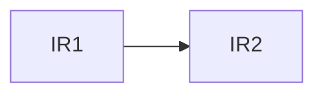
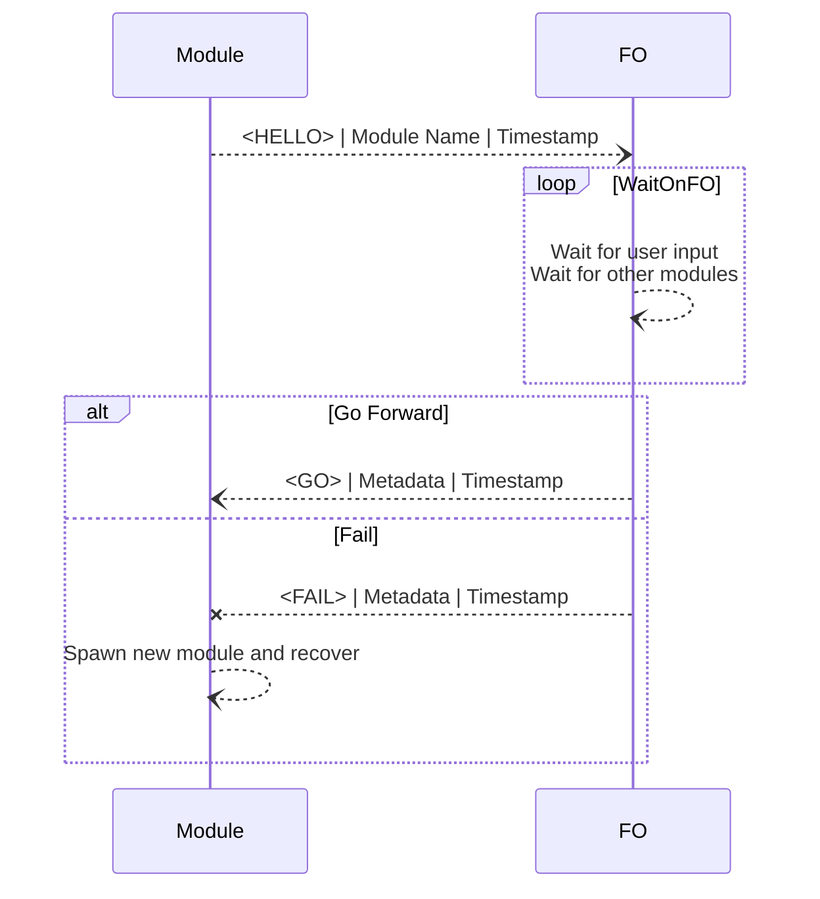

This will be a small documentation journal for me while I implement *something* that *somewhat* adheres to the [[No Failover]] specification.

This is just meant for me really just so I know what I'm doing and what I should revisit.

# General Architecture

On a high level, the controller testbed will be made from 4 separate modules, connected over a network:
- The **NIB**, an in-memory database 
- The **Routing Controller (RC)**, a frontend for scheduling IRs
- The **OpenFlow Controller (OFC)**, a pool of worker threads and a monitoring server that sends scheduled IRs to switches and confirms that they were installed in the data plane.
- The **Switch Infrastructure**, which is just a network of SDN-enabled switches that are connected to the controller at the beginning.

Our main goal, is to:
- Prepare the testbed for simulating failure scenarios, where modules may fail at any time between sending messages to each other, or certain operations within the same module (mostly on the NIB) may fail without being completed in one go.
- Measure and approximate **Convergence Time**, the time it takes for an *intent* sent to the RC to be actually installed in the data plane.
  The "intent" here, can be thought of as a DAG of IRs, where an IR may only be scheduled for installation, if and only if it's predecessors have already been installed.

We first implement the controller without the failure scenarios in mind, we then describe the architecture of the **Failure Orchestrator**, a module which we shall utilize to actually ***cause*** a certain failure scenario to happen.

We first describe the function of each module separately. We abstain from describing failure scenarios and reconciliation, and how they are handled yet, since that requires some context first and would be much easier to do once the high level description is done.

>[!NOTE] A General Note
>We are trying to replicate the specification as closely as possible. This however, does not mean that this would be a particularly efficient implementation, as quite a few things in the specification (like tagging entries in the NIB for specific worker threads) have solutions that are more efficient compared to the specification.
>
>We are not particularly concerned with the best performance here, we are concerned with making sure that the implementation follows the specification as closely as possible to avoid surprises.

We first start with the NIB, as it's the glue that holds everything together.

## NIB

The NIB is an in-memory database with some amount of partial or total replication to make it robust against certain amounts of stopping failures.

The NIB will still require permanent storage somewhere, since there are certain operations which absolutely need backups made (i.e. atomic operations). Besides these, individual operations on the NIB **can** fail without completion for each module.

The main function of the NIB is to:
- Consolidate the state data of each module. This includes:
	- A tag, that says what the module was doing/is doing.
	- Some metadata specific to that state.
	  For example, an OFC worker thread, currently trying to install an IR on a switch, may temporarily store that specific IR in the NIB for recovery if it fails and restarts before it manages to send that IR.
- Act as a glue that converts the whole infrastructure into a logically centralized software.

Individual failures inside the NIB are not considered. For all we care, anything we successfully put on the NIB, *stays* on the NIB as well. It is important to note however that as we said, individual operations on the NIB may fail arbitrarily.

### NIB Tables

Our implementation of the NIB is essentially just a SQL database, with the following tables:

- `controller_state`: The table that holds the state of individual modules and threads. This is what we use for reconciliation and recovery.
- `ir_status`: The table that holds the state of individual IRs, telling us whether or not they have finished, or already sent and whatnot.
- `sw_status`: The table that holds the state of individual switches in the topology.
- `ir_work_list`: The table that holds the list of IRs that OFC workers may acquire and install.
- `ir_scheduled_list`: The table that holds the list of IRs currently scheduled by the routing controller.

Take care to understand the difference between `ir_work_list` and `ir_scheduled_list`:
- The work list contains IRs that are actively being worked on in the OFC, which means that worker threads in the OFC are using them.
- The scheduled set contains IRs that the worker threads of the routing controller have installed in the NIB. These are "scheduled", i.e. waiting to be picked up by worker threads of OFC.

### IRs

An IR, is an intent collected from a higher level application that can be converted to an OpenFlow instruction by an OFC worker and installed in a controller. IRs may have dependencies, meaning that they require a certain order of installation to be satisfied (even if the instruction itself, may not exhibit any such behavior or requirement). The controller may not at any point violate the order of IR installation, this is an invariant of the controller specification.

For our intents and purposes, we may omit that fact that these are intents, and instead assume they are direct OpenFlow instructions that we can send to an Open vSwitch instance, as turning intents into an actual OpenFlow instruction is just a functional mapping that can be done in the OFC and does not change anything in the specification.

For our current implementation, each IR is basically just:
- A string, which is the command passed to the Open vSwitch instance
- A switch name, saying where this IR is actually headed (in the spec., this is a separate variable called `IR2SW`, chosen during the generation of the IR DAG, but we don't need to do that here).
- A unique identifier (this is our own addition, it's not necessary), just to track the IR in the system.

Depending on where the IR is actually stored, we may also need to use other fields:
- In the RC, each IR would need an ordering in the DAG to show whether or not it's predecessors have been satisfied.
- In the `ir_work_list`, each IR will also need a tag, which identifies the OFC worker thread that is supposed to handle it.

### NIB Operations

The NIB supports insertion, deletion and query operations on all tables. For the `ir_work_list` table in particular though, we need to support 3 specific operations as defined in the specification.

These operations ***may only be performed by OFC workers***, meaning that they can also provide the operation with their own unique identifier (we'll discuss this more in the OFC section).

The operations are:

- **Enqueue IR:** Add an IR into the table and tag it with nothing (i.e. `NO_TAG` in the spec.) to show that no OFC threads have even looked at it.
- **Read IR:** Read an IR from the NIB such that either:
	- It is already tagged by the calling thread.
	- It is untagged and no entry exists in the list that is tagged by the calling thread.
- **Remove IR:** Remove the IR in the table that is currently returned by performing the read operation.

### Controller Module States

Each controller module will record it's state and some metadata for that state in the NIB. For the most part (with exactly on exception that we'll discuss later), this metadata is again just a single IR. The state is just a string for our purposes, which we are copying directly from the specification.

When and where the access to this NIB table will be needed is dictated solely by the specification and we will explicitly mention how and in what order this needs to be done once we discuss individual controller module procedures.

### NIB Implementation

At the beginning of operation, NIB initializes it's tables and then listens on a dedicated port for other modules.

We are not implementing caching or multi-processing on the database, and thus, are not particularly concerned with the performance of the NIB at this moment. If at some point these do become relevant, then we will need to overhaul the NIB completely.

We are however, taking a single deviation from the specification here. As we shall see, the sequencer module in the Routing Controller is the main starting point of operation, and it starts by loading the IRs into memory and scheduling them.

However, the specification assumes the scheduled IRs are user defined, meaning that they are given to the RC at the beginning of execution and persist across failures in the sequencer. While this has no problem on it's own, it just makes it easier (and more logical) for the sequencer to also put these IRs on the NIB, since the IRs will be referenced many times in different tables and it just makes much more sense to establish a foreign key relation to these IRs, instead of just putting multiple copies of them on the NIB.

Thus, we have modified the sequencer initialization procedure, which involves the sequencer connecting to the NIB at startup, and uploading all user defined IRs directly to the NIB. Afterwards, the NIB will reference these IRs with a unique ID as a key to establish relations between other tables and individual IRs.

## Routing Controller (RC)

The RC, accepts a DAG of IRs, and then schedules them into the controller. 

The RC specification, generates non-isomorphic DAGs of a maximum size, and then schedules them and checks for invariant violations. We don't need to do this, we can assume the intent is given to us at the start of the program (so, think of some user who initially programs the RC with a persistent DAG of IRs that it wants to install).

Putting this aside, the main loop of the RC is:
- Periodically check all installed IRs by reading the NIB (i.e. check for IRs in `IR_DONE` state).
  Given the invariant that "when an IR is in `IR_DONE`, it never leaves that state", then the RC can safely forget about installed IRs after they are installed (the NIB of course, retains some state).
  With this information, we then find the set of **Valid** IRs, which are IRs that have satisfied dependencies, meaning that they do not have predecessors that are not in `ID_DONE` state.
- The RC will then collect these IRs in a set and start sending them by choosing one (no particular order is enforced in the spec. ) and put them in the set of scheduled IRs in the NIB.
- After this, the RC will mark the IR to be forwarded to OFC, by adding it to the queue of IRs in the NIB (i.e. `IRQueueNIB`), and then remove the IR from the set of IRs that are to be scheduled in the RC.

### Implementation

The RC will use several worker threads that are consolidated in the **Sequencer** module. These worker threads, grab an IR from the IR DAG and then put it on the NIB for further processing.

#### Note About Threads

Let us talk about "threads" in the specification for some clarity.
There are two separate sets of thread pools in the specification, the RC worker pool and the OFC worker pool. Threads are identified with a pair of the form `<thread_tag, thread_id>`, where `thread_tag` is one of either `ofc0` for OFC threads, or `rc0` for RC threads.

With this, the thread identifier in `thread_id` may just be arbitrary model values provided as constants to the specification. Thus, the tuple above will identify *any* worker thread, anywhere in the controller. This is paramount for tagging individual entries of the NIB.

It is easy to see that thread identifier need to be kept consistent, as if the thread currently doing a certain task suddenly exited for whatever reason, it ***cannot*** come back with a different identifier after it is restarted, as doing so would mean that it will not have access to the state data that it might have saved in the NIB (which is tagged with it's own unique identifier to separate it from the rest).

If the entire module however were to just die and restart, the identifiers for individual threads do not matter, they need only be in the same range as before. Thus, the easiest solution to make sure that thread identifiers are consistent, is to just use thread pools, and pass the identifier directly to the thread, or use the native identifier given by the thread pool.

Using python's `ThreadPoolExecutor`, this can also be paired with prefixes for each thread, so for example, RC threads will have the prefix `rc` and thus, once the thread name is queried, we will get `rc_x` for some integer `x`, depending on how many threads we want to allocate. We also don't need to worry about restarting and rescheduling threads, as the executor does this automatically.

#### Sequencer Implementation

The sequencer, first receives an IR DAG from a user application, or in our case, just starts with a local copy provided to it from, "somewhere".

In the specification, the DAG is generated in the sequencer, where we just choose a dependency graph from a set of non-isomorphic DAGs and just pass it to the sequencer for use. The sequencer then just keeps picking up different IRs when they are ready, assigning arbitrary ordering for which switch should receive the IR.

For the implementation:

- The DAG is given to the sequencer in a permanent storage (just assume it's a text file for example). It would make more sense for it to also be in the NIB, but that is not part of the specification, so we won't do it like that.
- Each IR in the DAG comes with a destination switch name, saying where we expect to have it installed.

Thus, each IR we provide to the sequencer will be of the following form:
```
<id> <sw> <order> <cmd>
```
So for example, two IRs depending like the following:



Where `IR1` goes to `sw1` and `IR2` goes to `sw2`, can be expressed like the following:

```
0 sw1 1 input=eth0, output=eth1
1 sw2 2 input=eth1, output=eth0
```
For some simple OVS flows instructions.

##### Initialization

When the sequencer comes up, it reads the given DAG file from permanent storage, and parses it into a list of IRs. If the sequencer is recovering from a recent failure, then some of these IRs may already have been scheduled or cached in the NIB, thus any operation in this stage will be ignored by the NIB if the sequencer attempts to insert data for an already existing IR.

Regardless, the sequencer will:
- Parse the DAG file and initialize connection to the NIB
- Update NIB tables or initialize them, which involves:
	- Uploading the parsed set of IRs, into the `ir_list` table in the NIB.
	- Setting the state of new IRs to `IR_NONE` in the `ir_status` table, while leaving alone any previous IR.
	- Initialize the process state table in the NIB to `NO_STATUS` if this is the first time the sequencer comes up.

After this, the sequencer starts it's worker threads.

##### Worker Threads

Each worker thread is named like `rc_x` for an integer `x` by the thread pool allocator. Each thread will first, gather the list of schedulable IRs by reading the NIB. 

A schedulable IR, is an IR that:
- Has satisfied dependencies
- It's destination switch state is `SW_RUN`
- Hasn't already been scheduled
- Has a state `IR_NONE`

This can be done by joining tables in the database to get the IRs that satisfy the second and fourth conditions. We then check for the first condition by checking whether or not IRs exist in `ir_status` which are not in `IR_DONE` and have a lower DAG order.

Finally, we check the scheduled IR set for the list of IRs generated in the previous step, and we either end up with an empty list, which means that the sequencer will just wait for a bit, or we end up with something to schedule.

In case there is nothing to do, out implementation just sleeps a bit and tries again (this is by no means efficient, we are just keeping things simple, plus this makes things less of a headache when the FO comes into play). Otherwise, we schedule all the IRs one by one.

##### Reconciliation

In case the sequencer fails, the watchdog will restart the module and call the recovery subroutine. The recovery subroutine:
- Checks for cached state in the NIB, by checking the last commit by the RC process.
- If such a record, with state `STATUS_START_SCHEDULING` exists:
	- If it does, it means that the RC failed some time after scheduling the IR, but before putting it in the OFC work list. 
	- If there is no such record, the RC restarts like normal

The above process can sometimes cause unnecessary rescheduling of the same IR, but OFC worker threads will know how to deal with it later, thus we are not worried about that now.

## OpenFlow Controller (OFC)

The OFC is the main OpenFlow frontend of the controller, turning IRs received from the sequencer into actual OpenFlow configuration messages that can be sent to switches.

The OFC consists of a pool of workers, and a monitoring server.

### Worker Pool 

Each OFC thread has a distinct identifier (it's `threadID`) that they use to tag an IR that they want to process. The key here, is to prevent simultaneous scheduling of the same IR in the controller. While this does not violate safety, the spec should try to minimize the amount of redundant scheduling of IRs.

Thus, the read operation performed by each worker on the NIB to grab a particular IR, is to first attempt to read it in `IRQueueNIB` (which requires them to acquire a lock so that only ONE worker accesses it), and then tag it with their identifier to "make it their own".

Queuing simultaneous access to a database is handled by the database frontend and is not something that we need to worry about. The above action however **needs** to be atomic, and thus some permanent storage should be used in tandem with the in-memory NIB to keep journals.

Once the read operation is done, the worker thread will then "lock" the IR, which prevents it from being owned by any other thread, effectively coupling the thread with that particular IR.

Now, we are processing specifically in the context of the worker thread associated with the IR. The thread will do the following:
- Read the IR and determine where it's headed. 
- Query the NIB and determine whether or not the destination switch actually exists in the topology, and if so, is this particular IR in `IR_NONE`?
  If so, then proceed.
- <b><u>(Update-Before-Action)</u></b> Set the IR state to `IR_SENT`.
- Now, we perform two operations, which can fail in between:
	- Convert the IR to an OpenFlow message and append it to the channel from the controller to the switch.
	- Save the state in the NIB, which includes the particular IR as well as the state identifier of this thread as `STATUS_SENT_DONE`.


# Failure Orchestrator (FO)

The FO is a separate module, living in isolation from the other modules in the controller.
It's purpose, is to essentially act as a controller debugger, putting breakpoints in certain operations on the controller and then (if needed) tell the controller module to self destruct and recover.

This can be used to queue up different modules, and simulate different failure scenarios.



The FO has simple message formatting, each message will have:
- A `type`, one of either:
	- `HELLO` for the initial connection of a module, giving it a unique name
	- `GO` for giving the module a green light to move forward
	- `FAIL` for killing the module and forcing it into recovery
- A `value` field, either a string or a Python dictionary (it's use depends on where you want to trigger a failure)
- A `timestamp`, either explicitly given, or automatically generated. Used for finding the convergence time value.

All modules attempting to use the FO, MUST create a global `FOBase` instance, pointed to:
- Where the module is, so that it can be restarted if needed
- A unique name for the module, which will be used in the `HELLO` message
- Where the FO is (for obvious reasons)

To insert a breakpoint on any function, one can use `failable` decorator in `nib_defs`:
```python
fo_obj = FOBase(...)

@failable(fo_obj, "<Breakpoint Name>")
def arbitrary_subroutine(*args, **kwargs):
	"""
	You can do anything here, *except* modifying the FO.
	The operation will either go forward wihtout any problem,
	or fail instantly and cause a recovery routine to kick in.
	"""
```
To disable the FO, simply set it's address to `None`, and the controller will work just well without it.