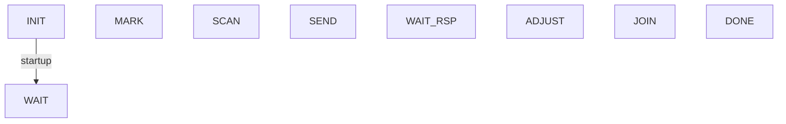

# Intro.

This is from the [TLA+ examples repository](https://github.com/tlaplus/Examples/), this specification is courtesy of *Prasad Narayana, Ruiming Chen, Yao Zhao, Yan Chen, Zhi (Judy) Fu, and Hai Zhou*, and provides an specification of [[WiMAX]] in TLA+.

We'll go over the specification here, both to learn a few things, and simply because it is interesting.

The model includes the ranging and authorization process, we'll start with the ranging process and then perhaps check the authorization process in the meantime.

## Messages

First we describe the messages used, as they are shared across all modules. We'll first start by declaring a constant `MaxReal` to control the number of states in a model, and through that we define a type we call `Real`, which we shall use to address MAC addresses and other things in the model.

We don't use `Int`, since it would be too large for our model space.

```
(*Shared Definitions*)

CONSTANTS MaxReal
Real == 0 .. MaxReal
Message == [
		type: {"RNG_RSP"}, status: {"Abort", "Continue", "Success"},
		cid: Real, max: Real, ulid: Int
	] \cup [
		type: {"RNG_REQ"}, dlid: Int, cid: Real, mac: Real, anomalies: {0, 1}
	] \cup [
		type: {"UL_MAP"}, ulid: Int
	]
```

Where `ulid` and `dlid` are referred to the Uplink and Downlink identifiers, and `cid` will refer to the decided channel identifier.

A utility to find certain message types in the queue will be most welcome, so let's write one. We'll call the Uplink and Downlink queues `DlChan` and `UlChan`,

```TLA+
(* Utility to find certan message types in the queues *)

FindMessage(tp) ==
  IF cid = 0 THEN
    IF tp = "UL_MAP" THEN
      LET
        cond(i) == /\ DlChan[currentChan].data[i] # << >> 
	               /\ DlChan[currentChan].data[i].type = tp
      IN
       IF \E i\in (1 .. Len(DlChan[currentChan].data)): cond(i) THEN
         LET
           k == CHOOSE j \in (1 .. Len(DlChan[currentChan].data)) : cond(j)
         IN DlChan[currentChan].data[k]
       ELSE << >>    
    ELSE
      LET
        cond(i) == /\ DlChan[currentChan].data[i] # << >>
                   /\ DlChan[currentChan].data[i].type = tp
                   /\ DlChan[currentChan].data[i].mac = Mac
      IN
       IF \E i\in (1 .. Len(DlChan[currentChan].data)): cond(i) THEN
         LET
           k == CHOOSE j \in (1 .. Len(DlChan[currentChan].data)) : cond(j)
         IN <<k, DlChan[currentChan].data[k]>>
       ELSE << >>
  ELSE
    IF tp = "UL_MAP" THEN
      LET
        cond(i) == /\ DlChan[currentChan].data[i] # << >>
                   /\ DlChan[currentChan].data[i].type = tp                  
      IN
       IF \E i\in (1 .. Len(DlChan[currentChan].data)): cond(i) THEN
         LET
           k == CHOOSE j \in (1 .. Len(DlChan[currentChan].data)) : cond(j)
         IN DlChan[currentChan].data[k]
       ELSE << >>    
    ELSE
      LET
        cond(i) == /\ DlChan[currentChan].slots[i].msg # << >>
                   /\ DlChan[currentChan].slots[i].msg.type = tp
                   /\ DlChan[currentChan].slots[i].cid = cid
      IN
       IF \E i\in (1 .. Len(DlChan[currentChan].slots)): cond(i) THEN
         LET
           k == CHOOSE j \in (1 .. Len(DlChan[currentChan].slots)) : cond(j)
         IN <<k, DlChan[currentChan].slots[k].msg>>
       ELSE << >>
```

## Subscriber Station Module

The first module is the SS module for the subscriber station.

It is identified with a unique MAC address, which we'll consider as a model parameter. The SS can be described with a `state` which holds the current state of the subscriber station.

We'll also specify the variables `msg` and `rsp` which will hold the messages sent from SS to BS and the messages received from BS respectively.

The FSM for he SS is as follows:




