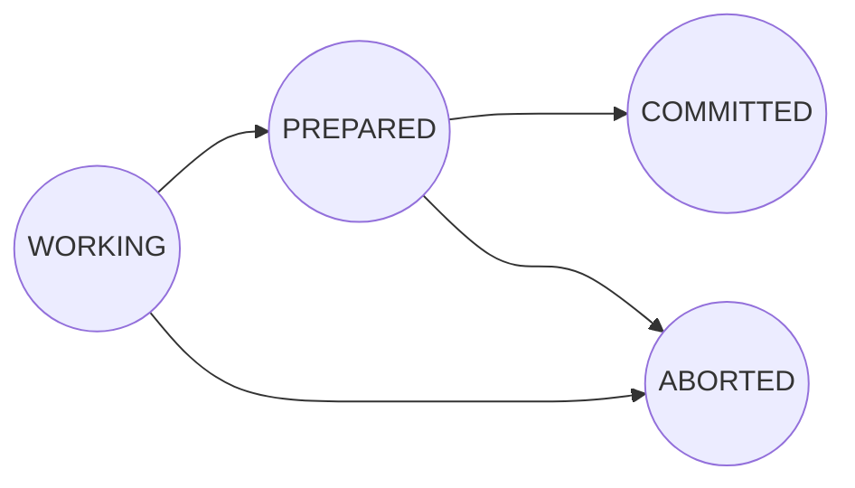
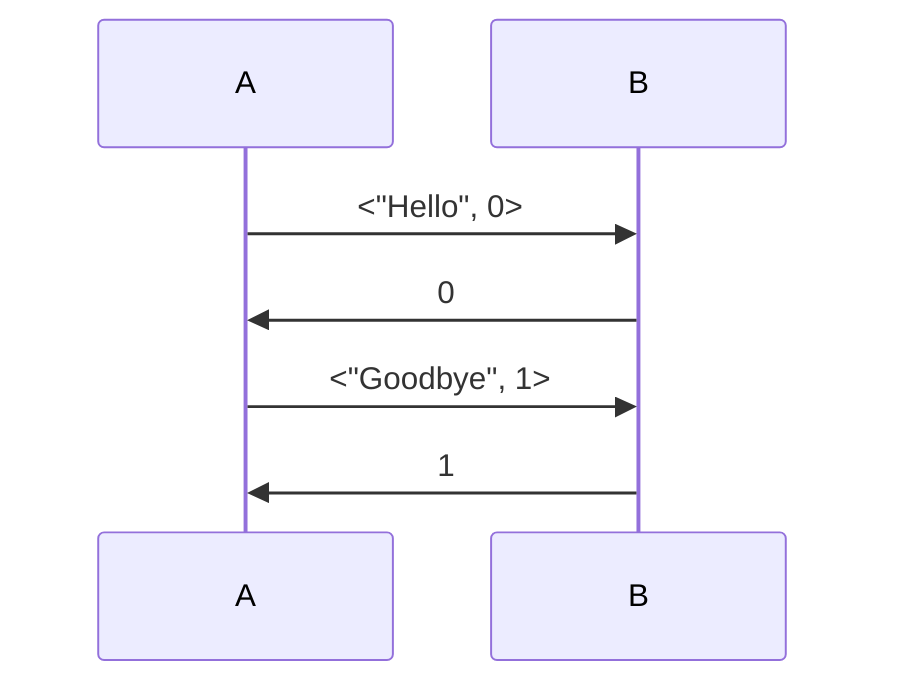
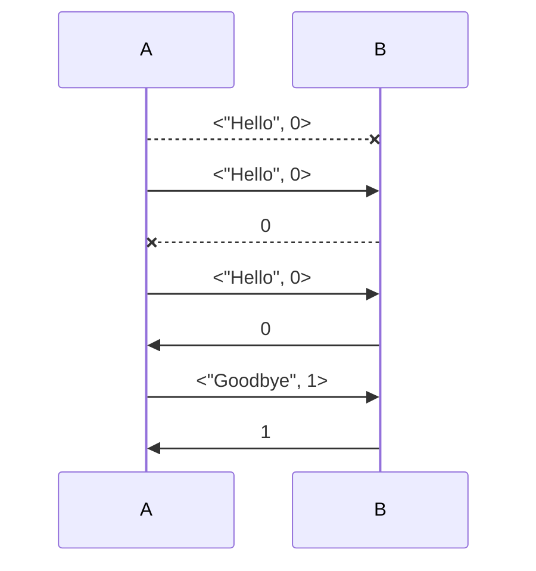

# Intro.

Here, I will write some examples in TLA+ and discuss exactly how they were written and what they mean. These come from various sources and cover different problems.

It does illustrate how to use [[TLA+]] and [[TLC]] model checker to a pretty nice degree.

## The *Die Hard* Jug Problem

This is courtesy of Lamport himself, in [one of his video series](http://lamport.azurewebsites.net/video/video4.html).

We have a 3 gallon jug and 5 gallon jug. We are given a water faucet and are asked to pour *exactly* 4 gallons of water into the 5 gallon jug.

>[!TIP]
>Lamport always suggests to write a correct solution (or a behavior, in TLA+ terms) for the problem that we are studying, preferably *by hand*.

### Example Behavior

Going step by step:
1. Fill the 3 gallon jug
2. Pour the 3 gallon jug into the 5 gallon jug
3. Fill the 3 gallon jug
4. Pour from the 3 gallon jug into the 5 gallon jug until the 5 gallon jug is completely full, leaving you with exactly 1 gallon in the 3 gallon jug
5. Empty the 5 gallon jug
6. Pour the 1 gallon of water in the 3 gallon jug, into the 5 gallon jug
7. Fill the 3 gallon jug
8. Pour the 3 gallon jug into the gallon jug, yielding exactly 4 gallon of water in the 5 gallon jug.

Writing in terms of variables, let *small* and *large* denote the 3 and 5 gallon jugs respectively. Both of these start at a value of 0. So the initial condition would be:
$$
	s_0 = \begin{bmatrix}
		 small = 0 \\
		 large = 0 
	\end{bmatrix}
$$
And so, the procedure above gives rise to this behavior:
$$
\begin{align}
&
\begin{bmatrix}
	small = 0 \\
	large = 0
\end{bmatrix}
\rightarrow
\begin{bmatrix}
	small = 3 \\
	large = 0
\end{bmatrix}
\rightarrow
\begin{bmatrix}
	small = 0 \\
	large = 3
\end{bmatrix}
\rightarrow
\begin{bmatrix}
	small = 3 \\
	large = 3
\end{bmatrix}
\rightarrow \\
&
\begin{bmatrix}
	small = 1 \\
	large = 5
\end{bmatrix}
\rightarrow
\begin{bmatrix}
	small = 1 \\
	large = 0
\end{bmatrix}
\rightarrow 
\begin{bmatrix}
	small = 0 \\
	large = 1
\end{bmatrix}
\rightarrow
\begin{bmatrix}
	small = 3 \\
	large = 1
\end{bmatrix}
\rightarrow
\begin{bmatrix}
	small = 0 \\
	large = 4
\end{bmatrix}
\end{align}
$$

So now, we learned:
- What are the atomic steps, i.e.:
	- We can fill a jug all the way up
	- We can transfer the contents of one jug to the other until the receiving jug is filled or the source jug is completely empty
- What are the variables, i.e.:
	- One variable *small* for the 3 gallon jug
	- One variable *large* for the 5 gallon jug

We create a module `DieHard` and since we'll have to use simple arithmetic's, we must import the `Integers`  module. This can be done by *extending* our current module. Variables can also be declared with `VARIABLES`.

```
=========== Module DieHard ===========
Extends Integers
VARIABLES small, large
...
```

>[!TIP]
>In TLA+, there is no type declaration. So it is a good idea to assert what kind of values these variables can take, both to make the spec more precise, and also to inform the reader about what sensible values these variables can take.
>
>One way to do this is to define a `TypeOK` formula that checks this. For example, in the previous example, we can type check the variables `small` and `large` with:
>$$
>	\begin{align}
>		TypeOK \triangleq & \wedge small \in 0 .. 3 \\
>		& \wedge large \in 0 .. 5
>	\end{align}
>$$

Now, the initial state can be specified as:
$$
\begin{align}
	Init \triangleq & \wedge small = 0 \\
	& \wedge large = 0
\end{align}
$$
Now, we have to define actions. There are 3 types of action (or 2 depending on how you define, but 3 is more atomic):
- An action to fill either jug completely
- An action to empty either jug completely
- An action to pour from one jug to the other

We can describe these actions as a state called `Next`. Usually, next can be characterized by the *OR* of any possible action in the problem. So we can write:
$$
\begin{align}
	Next \triangleq \vee & FillSmall \\
	\vee & FillLarge \\
	\vee & EmptySmall \\
	\vee & EmptyLarge \\
	\vee & SmallToLarge \\
	\vee & LargeToSmall
\end{align}
$$
We **MUST** define these states before defining `Next`, that's just how TLA+ works. 

So:

$$
FillSmall \triangleq \wedge \; small' = 3
$$
Which is **WRONG**.

>[!WARNING]- Why is this formula wrong for our specification?
>You must think of these formulas exactly as they are, i.e. formulas that are evaluated over states.
>
>The formula above returns `true` or `false` depending on the state. Whether or not it is suitable for our specification depends on whether or not it is actually behaving like how we want it.
>Take the state $\begin{bmatrix}small = 3\\large = 3\end{bmatrix}$.  For this state, the formula will return true. 
>
>**But** it will *also* return true for the state $\begin{bmatrix}small = 3\\large = \pi\end{bmatrix}$, which it shouldn't!
>
>The correct way of writing this would be:
>$$
>\begin{align}
>FillSmall \triangleq & \wedge small' = 3 \\
>& \wedge large' = large\\
>\end{align}
>$$

The other formula, `FillLarge` is similar.

### Formula For Pouring From The Small Jug To The Large Jug

Two cases must be taken into account:
- Either there is room in `large` for the content of `small`
- Or there isn't enough room in `large`.

We need an "if" here:

$$
\begin{align}
	SmallToBig \triangleq \;
	& IF \quad large + small \leq 5 \\
	& \quad \quad \wedge \; small' = 0 \\
	& \quad \quad \wedge \; large' = large + small \\
	& ELSE \\
	& \quad \quad \wedge \; large' = 5 \\
	& \quad \quad \wedge \; small' = large + small - 5
\end{align}
$$
### Formula For Pouring From The Large Jug To The Small Jug

Similar to the one above:
$$
\begin{align}
	SmallToBig \triangleq \;
	& IF \quad large + small \leq 3 \\
	& \quad \quad \wedge \; small' = large + small \\
	& \quad \quad \wedge \; large' = 0 \\
	& ELSE \\
	& \quad \quad \wedge \; large' = large + small - 3 \\
	& \quad \quad \wedge \; small' = 3
\end{align}
$$
### The Spec Body
```
EXTENDS Integers

VARIABLES small, big   
          
TypeOK == /\ small \in 0..3 
          /\ big   \in 0..5

Init == /\ big   = 0 
        /\ small = 0

FillSmall == /\ small' = 3 
             /\ big'   = big

FillBig == /\ big'   = 5 
           /\ small' = small

EmptySmall == /\ small' = 0 
              /\ big'   = big

EmptyBig == /\ big'   = 0 
            /\ small' = small

SmallToBig == IF big + small =< 5
               THEN /\ big'   = big + small
                    /\ small' = 0
               ELSE /\ big'   = 5
                    /\ small' = small - (5 - big)

BigToSmall == IF big + small =< 3
               THEN /\ big'   = 0 
                    /\ small' = big + small
               ELSE /\ big'   = small - (3 - big)
                    /\ small' = 3

Next == \/ FillSmall 
        \/ FillBig    
        \/ EmptySmall 
        \/ EmptyBig    
        \/ SmallToBig    
        \/ BigToSmall
```

Now you can check this with the [[TLC Model Checker]]. To find what we have to do to fill the large jug with 4 gallon, we can use the invariant  `large /= 4` or equivalently `large # 4`.


## The Transaction Commit Problem

The problem occurs when we discuss the implementation of databases (or weddings!). Multiple parties can be involved in this problem. In case of designing databases, these parties are called *Resource Managers* or simply RM.

We must design a controller that *commits* a certain action into the database. The constraint is that the commit should happen only if **all** the participants (the RMs) are ready to commit, and it should be **impossible** for any of the RMs to disagree about the outcome of the commit (i.e. whether or not it happened or was aborted).

In terms of state machines, each RM has a state machine like below:

We are bound by **agreement**, at the end, all RMs must be ether in `COMMITTED` or `ABORTED`. 

### Type Invariant And Initializer Predicate

The beginning is simple enough. Once we are encouraged to write an example, but the variables here are pretty straightforward, the main one being the state of any RM in the algorithm which we can denote with the set $rmState$.

The algorithm has an input parameter, namely the number of participating resource managers. This is a *constant*, since it cannot change after the algorithm has started, so we should probably declare it with the `CONSTANT` keyword, which means that TLA+ checks that at no state, the value of it changes.

So the spec would be:

```
=========== TCommit ===========
CONSTANT RM
VARIABLE rmState

(* Type Checking Invariant *)
TCTypeOK == 
	rmState \in [RM -> {"WORKING", "PREPARED", "ABORTED", "COMMITTED"}]

(* Init. Predicate *)
TCInit == rmState = [rm \in RM |-> "WORKING"]
```

These are simple, the predicate for the next state is more interesting:

### Next State Predicate

```
TCNext == \E r \in RM Prepare(rm) \/ Decide(rm)
```

Which means that for each transition, there should be *some* resource manager that either prepares itself or just decides (we interpret this from the state diagram of the RMs).

So what are the `Prepare` and `Decide` predicates? And how do we actually input a resource manager into them in parenthesis?

Let's check `Prepare` first, remember that predicates act like functions for the most part, so we can actually input things into them, that's what the parenthesis are used for, but the predicate itself must say that: 

>For the RM passed to this predicate, given that the current value of it's `rmState` is `WORKING`, then the value of it's `rmState` in the next state must be `PREPARED`, **and the rest left unchanged**.

Don't forget about the part that we bolded, it's important!

So one way to write this would be:
$$
\begin{align}
	rmState' = [s\in RM \rightarrowtail IF\quad s=r\quad &THEN \quad \text{"PREPARED"}\\
	& ELSE \quad rmState[s]]
\end{align}
$$
We are saying that the `rmState` in the next state will equal all it's current values, except for the index `r` which we will assign the value `PREPARED`.

This is wordy, and it comes up way to often to justify it's length, so TLA+ shows some mercy and offers a syntax for it:
$$
[rmState \quad EXCEPT \quad ![r] = \text{"PREPARED"}]
$$
And so `Prepare` will end up being:
$$
\begin{align}
	Prepare(rm) \triangleq & \wedge rmState[rm] = \text{"WORKING"} \\
	& \wedge [rmState \quad EXCEPT \quad ![r]=\text{"PREPARED"}]
\end{align}
$$
And for `Decide`, we'll create some helpers first. Remember that we are bound by **Agreement**. so we should reflect it in the predicate that decides the final commit, so we need to have something that tells us whether or not we *can* commit now. 

We can commit if and only if no one has aborted yet. So we can let:
$$
canCommit = \forall\;rm \in RM:\; rmState[rm] = \{\text{"PREPARED", "COMMITED"}\}
$$
And another one for checking if anyone *has* committed:
$$
notCommitted = \forall\; rm \in RM:\; rmState[rm] \neq \text{"COMMITED"}
$$
And with this, we can write the state transition that takes a manager into either committing or aborting. That would be:
$$
\begin{align}
		Decide(rm) \triangleq & \vee \wedge \; rmState[rm] = \text{"PREPARED"}\\
		& \quad \wedge \; canCommit \\
		& \quad \wedge \; rmState' = [rmState\quad EXCEPT \quad ![rm]=\text{"COMMITTED"}]\\
		& \vee \wedge \; rmState[rm] \in \{\text{"WORKING", "PREPARED"}\}\\
		& \quad \wedge \; notCommitted \\
		& \quad \wedge \; rmState' = [rmState\quad EXCEPT \quad ![rm]=\text{"ABORTED"}]
\end{align}
$$
Which means that a resource manager may only decide the final result all by itself, if and only if one of the following holds:
- They are prepared and are sure that no one has aborted or unready, which they then might decide to commit.
- They are either working or prepared, are sure that no one has committed yet, and so may decide to abort the process.

### Agreement Invariant

This finishes the spec. As for the invariant that the spec must fulfill, the invariant is `agreement` and that entails that at the end, no processes should be able to disagree on the outcome, so:
$$
\begin{align}
TCAgree \triangleq \forall \; r_1, r_2 : \; \neg \; & \wedge rmState[r_1] = \text{"COMITTED"} \\
& \wedge rmState[r_2] = \text{"ABORTED"}
\end{align}
$$
Which we can add to the invariants in the model and check it alongside `TCTypeOK`.


## Two Phase Commit

Now we actually *implement* the controller for transaction commit (the Transaction Manager or TM for short).

The previous example told us *what* we need to implement, now we specify *how* we implemented it.

>[!REMINDER] Two Phase Commit
>With a two phase commit, the minister maintains a set of *prepared* participants, initially just empty. The minister asks each participant about what state they are in, and whether or not they wish to undergo the commit. 
>
>The participants receive these messages and respond. The minister only decides when either all participants report being prepared (and so commits) or nullifies the commit if someone disagrees.

So according to above, we need the following variables and constants.

```
CONSTANT RM          \* Set of all resource managers
VARIABLES
	rmState,         \* rmState[r] is the state of RM r
	tmState,         \* The state of the transaction manager
	tmPrepared,      \* The set of RMs that the TM knows are prepared
	msg              \* Messages that are flying around
```

We need to at least define what a message is, but for now, let us focus on more familiar things.

### Type Invariant And Initializing Predicate

We have the usual type invariant that we always have:
$$
\begin{align}
	TPTypeOK \triangleq & \\
	& \wedge rmState \in [RM \rightarrowtail \{\text{"PREPARED", "WORKING", "COMMITTED", "ABORTED"}\}] \\
	& \wedge tmState \in \{\text{"INIT", "DONE"}\} \\
	& \wedge tmPrepared \subseteq RM \\
	& \wedge msgs \subseteq Messages
\end{align}
$$

>[!FAQ] Passing Messages?
> We have not really encountered a problem about "passing messages", and while it looks alien, note that we don't need to actually implement how this message passing is done. It should only tell us *what it does*.

With this in mind, we can define the set $Messages$ to be the set of all messages currently in the network, and then remove that message from the set once it is received.

There is also another way though, where we can define this set to be all messages that were ever sent. This has the subtle difference that a process might receive a message multiple times, as it is no longer really removed from the set of $Messages$. Whether or not this is desirable, depends on the implementation.

For Two Phase Commit, we have no problem with this. So we can let this set be:
$$
Messages \triangleq [type:\{\text{"PREPARED"}\},\;rm: RM] \cup [type:\{\text{"COMMITTED", "ABORTED"}\}] 
$$
So what is this?
- The first set is the message that a resource manager sends to the TM to say that "I am prepared"
- The second set is the message that the TM will send to the RMs when the deed is done.

Now, for the initial state:
$$
\begin{align}
TPInit \triangleq & \wedge rmState = [r\in RM \rightarrowtail \text{"WORKING"}] \\
& \wedge tmState = \text{"INIT"} \\
& \wedge tmPrepared = \{\} \\
& \wedge msgs = \{\}
\end{align}
$$
Now, we need to write the next state formulas. 

### Next State Predicate

There are two sets of participants in this protocol, the RM and the TM. Let's start with the TM; It is wise to break this down well enough.

We start with what happens when the TM receives a *Prepared* message from the RM, let's call this predicate `TMRecvPrepared`. We also let the RM be inputted into the predicate.

So, when we receive such a message, we add $r$ to the set $tmPrepared$, but before that we should first make sure that we received it at the right time, and that the message was indeed actually sent at some point. It goes without saying that we keep other states unchanged as well.
$$
\begin{align}
TMRecvPrepared(r) \triangleq
& \wedge \; tmState = \text{"INIT"} \\
& \wedge \; [type \rightarrowtail \text{"PREPARED"}, rm \rightarrowtail r] \in msgs \\
& \wedge \; tmPrepared ' = tmPrepared \cup \{r\} \\
& \wedge \text{UNCAHNGED} \; \langle rmState, tmState, msgs \rangle
\end{align}
$$

>[!NOTE] Enabling Formulas
>The first two lines in the $TMRecvPrepared$ predicate, are *enabling* formulas, meaning that they enable the transition and make sure that the conditions required for it are satisfied.
>
>It is accustom that enabling formulas come first in the conjunction chain when writing temporal predicates.

There is $TMCommit$ where the TM sends commit messages to all the RMs and sets $tmState$ to $\text{"DONE"}$. It is enabled when $tmState$ equals $\text{"INIT"}$ and $tmPrepared$ equals $RM$.
$$
\begin{align}
TMCommit \triangleq & \wedge tmState = \text{"INIT"} \\
& \wedge tmPrepared = RM \\
& \wedge msgs' = msgs \cup \{[type \rightarrowtail \text{"COMMITTED"}]\} \\
& \wedge tmState' = \text{"DONE"} \\
& \wedge \text{UNCHANGED} \; \langle rmState, tmPrepared\rangle
\end{align}
$$

There is $TMAbort$ where the TM sends abort messages to all the RMs and sets $tmState$ to $\text{"DONE"}$. It is enabled when $tmState$ equals $\text{"INIT"}$.
$$
\begin{align}
TMAbort \triangleq & \wedge tmState = \text{"INIT"} \\
& \wedge msgs' = msgs \cup \{[type \rightarrowtail \text{"ABORTED"}]\} \\
& \wedge tmState' = \text{"DONE"} \\
& \wedge \text{UNCHANGED} \; \langle rmState, tmPrepared \rangle
\end{align}
$$

There is $RMPrepare(r)$ which is enabled when the RM $r$ sends a message to the TM saying that it is ready to commit. It is enabled only when $rmState[r] = \text{"WORKING"}$, so we have:
$$
\begin{align}
RMPrepare(r) \triangleq & \wedge rmState[r] = \text{"WORKING"} \\
& \wedge msgs' = msgs \cup \{[type \rightarrowtail \text{"PREPARED"}, rm \rightarrowtail r]\} \\
& \wedge rmState' = [rmState \quad \text{EXCEPT} \quad ![r] = \text{"PREPARED"}]\\
& \wedge \text{UNCHANGED} \; \langle tmState, tmPrepare \rangle
\end{align}
$$

There is $RMChooseToAbort$ which means that RM can go to the $\text{"ABORTED"}$ state. It is enabled when the current state is $\text{"WORKING"}$ and no one has committed.
$$
\begin{align}
RMChooseToAbort(r) \triangleq & \wedge rmState[r] = \text{"WORKING"}\\
& \wedge rmState' = [rmState \quad \text{EXCEPT} \quad ![r] = \text{"ABORTED"}] \\
& \wedge \text{UNCHANGED} \; \langle tmState, tmPrepared, msgs \rangle
\end{align}
$$

There is $RMRecvCommitMessage$ which means that a RM has received a commit message from the TM and must now agree to the commit. It is enabled when there is actually a commit message from the TM.
$$
\begin{align}
RMRecvCommitMessage \triangleq & \wedge [type \rightarrowtail \text{"COMMITTED"}] \in msgs \\
& \wedge rmState' = [rmState \quad \text{EXCEPT} \quad ![r] = \text{"COMMITTED"}] \\
& \wedge \text{UNCHANGED} \; \langle tmState, tmPrepared, msgs \rangle
\end{align}
$$

There is $RMRecvAbortMessage$ which is the same as above, except we received an abort from the TM:
$$
\begin{align}
RMRecvCommitMessage \triangleq & \wedge [type \rightarrowtail \text{"ABORTED"}] \in msgs \\
& \wedge rmState' = [rmState \quad \text{EXCEPT} \quad ![r] = \text{"ABORTED"}] \\
& \wedge \text{UNCHANGED} \; \langle tmState, tmPrepared, msgs \rangle
\end{align}
$$

And so finally, we can write the next state predicate as:
$$
\begin{align}
TPNext \triangleq & \vee TMCommit \\
& \vee TMAbort \\
& \vee \exists\; r \in RM: & \\
& & TMRecvPrepared(r) \vee RMPreare(r) \vee RMChosenToAbort(r)\\
& & \vee RMRecvCommitMessage(r) \vee RMRecvAbortMessage(r)
\end{align}
$$
And that finishes the spec. Now all we need to do is to check if this actually is a valid transaction commit implementation.

We already have the $TCommit$ spec that tells what $TPCommit$ should do, so all we need to do is to check the agreement condition that we wrote in $TCommit$, and to do that, we import it with the `INSTANCE` statement, and finally check it in the [[TLC Model Checker]].
## Paxos Commit

[[Paxos]] is of course a very neat algorithm, so why not use it as a commit protocol?

There is of course an obvious problem with Two Phase Commit, it can hang forever if the TM fails, so we might want to have multiple TMs in the system, and have them agree upon a value first and then we can tell others about it. 

For the agreement part, and since we are considering the scenario where one TM might fail, we can consider using Paxos here.

We are more fixated on introducing some remaining TLA+ syntax here, the bulk of the code is not too dissimilar to [[#Two Phase Commit]].

### Defining $Maximum(S)$ 

We define the maximum of set $S$ as $Maximum(S)$ like the following:
$$
\begin{align}
Maximum(S) \triangleq \; \text{IF} \; S=\{\} \quad & \text{THEN} \quad 
\text{-}1 \\
& \text{ELSE} \quad \text{CHOOSE}\quad n\in S: (\forall\; m \in S: n \geq m)
\end{align}
$$
So if $S$ is empty, just return -1.

To write this in TLA+, we need to use some rather arcane syntax:

```
Maximum(S) ==
		LET Max[T \in SUBSET S] == 
			IF T = {} THEN -1
					  ELSE LET n == CHOOSE n \in T: TRUE
							   rmax == Max[T \ {n}]
						   IN  IF n \geq rmax THEN n ELSE rmax
		IN Max[S]
```

This is basically a recursive `LET-IN` call, it essentially keeps removing an element and comparing it to the maximum of the rest until the set is emptied.

### Variables And Constants

This algorithm calls for the following variables:

```
CONSTANT RM,         \* The set of resource managers
	     Acceptors,  \* The set of acceptors
	     Majority,   \* The set of majoroties acceptors
	     Ballot      \* The set of all ballot identifiers

VARIABLES rmState,   \* rmState[r] is the state of resource manager "r"
		  aState,    \* aState[i][a] is the state of acceptor "a" in instacne "i"
		  msgs       \* Set of all messages
```

It is **ALWAYS** recommended that constants be followed with an `ASSUME` statement to clarify their roles and types:
$$
\begin{align}
\text{ASSUME} \\
\quad & \wedge Ballot \subseteq Nat \\
& \wedge 0 \in Ballot \\
& \wedge Majority \subseteq \text{SUBSET}\; Acceptor\\
& \wedge \forall\; MS1, MS2 \in Majority: MS1 \cap MS2 \neq \{\}
\end{align}
$$
Which just means:
- Ballots are a subset of natural numbers
- 0 by default a ballot identifier
- Majority is some subset of Acceptor (i.e. Majority is in the powerset of Acceptor)
- Every two elements of Majority have at least one element in common

### Messages

Once again, we define messages as a set of records:
$$
\begin{align}
Messages \triangleq \\
& [type: \{\text{"phase1a"}\},\; ins: RM,\; bal: Ballot \textbackslash\{0\}] \\
& \quad \cup \\
& [type: \{\text{"phase1b"}\},\; ins: RM,\; mbal: Ballot,\; bal: Ballot \cup \{-1\}\\
&\; val: \{\text{"PREPARED", "ABORTED", "NONE}\},\; acc: Acceptor] \\
& \quad \cup \\
& [type: \{\text{"phase2a"}\},\; ins: RM, \; bal: Ballot, \; val: \{\text{"PREPARED","ABORTED"}\}]\\
& \quad \cup \\
& [type: \{\text{"phase2b"}\},\; ins: RM,\; acc: Acceptor,\; bal: Ballot, \; \\
& \; val: \{\text{"PREPARED","ABORTED"}\}]\\
& \quad \cup \\
& [type: \{\text{"COMMITTED", "ABORTED"}\}]
\end{align}
$$

### Type Invariant
$$
\begin{align}
PCTypeOK \triangleq & \wedge rmState \in [RM \rightarrowtail \{\text{"WORKING", "PREPARED", "COMMITTED", "ABORTED"}\}] \\
& \wedge aState \in [RM \rightarrowtail [Acceptor \rightarrowtail [mbal: Ballot,\; bal: Ballot \cup \{-1\}, \; val: \{\text{"PREPARED", "ABORTED", "NONE"}\}]]]\\
& \wedge msgs \subseteq Messages
\end{align}
$$

The second line is pretty chubby, but it essentially defines that `aState` is a two dimensional array, and each element is a record with keys `mbal`, `bal` and `val`.  The indices are from sets `RM` and `Acceptor` respectively. So for example we can check elements like $aState[r][a].bal = -1$ to see if -1 is actually used for the ballot number or not.


## Alternating Bit Protocol

The Alternating Bit protocol (or AB for short) sends a sequence from a source to a destination using an alternating bit as a "clock" of sorts.

One trivial way would be to maintain a state for the sender and receiver (let's call them A and B) named $AVar$ and $BVar$ and when A wishes to send a string, set $AVar$ to that string, and let the next step action be to set $BVar$ to $AVar$.

This has the problem that it does not allow sending repeated values, a change in $BVar$ requires a change in $AVar$, but repeated values don't do that.

So we add another variable to the states, a bit that alternates each time we want to send a value, and that's it.

### The Spec.

So for the module:

```
============ MODULE ABSpec ===============
EXTENDS Integers

CONSTANT Data        \* what we want to send
VARIABLES AVar, BVar \* state variables

TypeOK == /\ AVar \in Data \X {0, 1}
		  /\ BVar \in Data \X {0, 1}

vars == <<AVar, BVar>>
```

For initiation, we let the bit be just 1, and we also need to set that $BVar$ equals to $AVar$, lest we allow for states that send arbitrary strings at the beginning.
$$
\begin{align}
Init \triangleq & \wedge AVar \in Data \times \{1\} \\
& \wedge BVar = AVar
\end{align}
$$
Now for the actions:
$$
\begin{align}
ASends \triangleq & \wedge AVar = BVar \\
& \wedge \exists\; d \in Data : AVar' = \langle d, 1 - AVar[2] \rangle \\
& \wedge BVar' = BVar
\end{align}
$$
And similarly:
$$
\begin{align}
BRecvs \triangleq & \wedge AVar \neq BVar \\
& \wedge BVar' = AVar \\
& \wedge AVar' = AVar \\
\end{align}
$$
So the next step predicate and the final spec would be:
$$
\begin{align}
Next \triangleq ASends \vee BRecvs \\
ABSpec \triangleq Init \wedge \square\; Next_{vars}
\end{align}
$$
This specifies what behaviors we should consider for our implementation, we have not yet however specified what it *must* implement.

In more mathematical terms, out specification so far only guarantees *safety*, it specifies that it only verifies implementations that do not violate the $ABSpec$ (i.e. $Init$ is true at the beginning, $Next$ is true on all steps, stuttering steps are allowed).

### Liveness

We want that "Every value sent by A, is received by B eventually".

So:
$$
\forall\; v \in Data \times \{0, 1\}: (AVar = v) \rightsquigarrow (BVar = v)
$$
### Implementation

We have described the safety formula for the protocol in the previous spec, but we have not yet implemented it.

First, we make a simple generalization, where the two sides can exchange messages bidirectionally, so A can send messages to B and so can B send messages to A.

The messages that B can send to A however are different, they are *acknowledgements* that B has received the message that A sent, and it will do it by sending the bit that A has sent back to A.

Here is an example:


This is the most basic example of a communication between the two, however, we add the extra condition that messages can be lost, specifically, A cannot be sure that B would ever receive it's message if it does not keep trying to send it.

To make this a bit better, we specify that A and B both need to keep sending their messages to avoid it being lost, so an example of the communication between the two in this way would be:

Channels can be modeled as queues, so a sequence for each channel (here called $AtoB$ and $BtoA$ would be enough).

So let:
```
======== MODULE AB ========
EXTENDS Integers, Sequences
CONSTANT Data
VARIABLES AVar, BVar, AtoB, BtoA

vars == <<AVar, BVar, AtoB, BtoA>>

TypeOK == /\ AVar \in Data \X {0, 1}
		  /\ BVar \in Data \X {0, 1}
		  /\ AtoB in Seq(Data \X {0, 1})
		  /\ BtpA in Seq({0, 1})
Init ==   /\ AVar \in Data \X {1}
          /\ BVar = AVar
          /\ AtoB = <<>>
		  /\ BtoA = <<>>
```

Now for the actions, both A and B must be able to send and receive certain types of messages. So let's implement these actions.

Let's start with A, since A repeatedly should send messages, then there isn't any requirements for enabling it, A can send messages at will, so:

```
ASnd == /\ AtoB' = Append(AtoB, AVar)
        /\ UNCHANGED <<AVar, BVar, BtoA>>
```

And for B, the same also follows:

```
BSnd == /\ BtoA' = Append(BtoA, BVar[2])
		/\ UNCHANGED <<AVar, BVar, AtoB>>
```

Now for receiving, there should be *something* to receive in the first place, so at least the channel should be nonempty. On the other hand, A expects only acknowledgements from B, and so the bits of the message and $AVar$ should match, otherwise we ignore the message and remove it from the queue, so we have:

```
ARcv == /\ Len(BtoA) # 0
		/\ IF Head(BtoA) = AVar[2]
			THEN \E d \in Data: AVar' = <<d, 1 - AVar[2]>>
			ELSE AVar' = AVar
		/\ BtoA' = Tail(BtoA)
		/\ UNCHANGED <<BVar, AtoB>>
```

Same goes for B:

```
BRcv == /\ Len(AtoB) # 0
		/\ IF Head(AtoB) # BVar[2]
			THEN BVar' = Head(AtoB)
			ELSE BVar' = BVar
		/\ AtoB' = Tail(AtoB)
		/\ UNCHANGED <<AVar, BtoA>>
```

Now for the interesting part, we need an action that non-deterministically removes a message from the queues $AtoB$ or $BtoA$, or just do nothing. 
That can be the following:

```
LoseMsg == /\ \/ /\ \E i \in 1..Len(AtoB): AtoB' = Remove(i, AtoB)
				 /\ BtoA' = BtoA
			  \/ /\ \E i \in 1..Len(BtoA): BtoA' = Remove(i, BtoA)
				 /\ AtoB' = AtoB
		   /\ UNCHANGED <<AVar, BVar>>
```

And so, for $Next$ we'll have:

```
NEXT == /\ ASnd
		\/ ARcv
		\/ BSnd
		\/ BRcv
		\/ LoseMsg
```

And finally, the $Spec$ is:

```
SPEC == INIT /\ [][NEXT]_vars
```


### Fairness

We need to assert fairness, since we want to assume that messages keep getting sent to their destinations. We have discussed that this is done by creating a new spec called $FairSpec$ which is essential the conjunction of $Spec$ with some fairness expressions.

This isn't as easy as the last time though, we can't use $WF_{vars}(Spec)$, since it would allow for infinite unacknowledged messages from either A or B, we need to specify separate actions for fairness.

We also don't need to specify fairness over $LostMsg$, we don't want to lose messages many times. So let's test:
$$
\begin{align}
FairSpec \triangleq Spec & \wedge WF_{vars}(ASnd) \wedge WF_{vars}(BSnd) \\
& \wedge WF_{vars}(ARcv) \wedge WF_{vars}(BRcv)
\end{align}
$$
Done? Well, **NO!**

This does not work.

>[!FAQ]- Why It Does Not Work?
>TLC produces a counter example, where:
>- A sends a message
>- B sends an ACK
>- The message from A is lost
>- The message from B is lost
>- repeat!
>This is fair to $ASnd$ and $BSnd$, since they both keep happening. What about $ARcv$? Well it is disabled at first, but is enabled when B sends an ACK, but since we lose it, it becomes disabled again, and this keeps happening.
>Same goes for $BRcv$, so neither of these actions are continuously enabled, and so *weak* fairness is not violated for them!
>
>So while the implementation remains fair, it does not implement the spec, since we don't have weak fairness for receiving messages! So TLC complains that the theorem is violated.

It is not hard to see that $ARcv$ and $BRcv$ need to be strongly fair. So we have:
$$
\begin{align}
FairSpec \triangleq Spec & \wedge WF_{vars}(ASnd) \wedge WF_{vars}(BSnd) \\
& \wedge SF_{vars}(ARcv) \wedge SF_{vars}(BRcv)
\end{align}
$$
### Corruptible Messages

We allow messages to be corrupted, replacing them by as value `BAD` that is unique and never sent.

So we have:

```
EXTENDS Integers, Sequences
CONSTANTS Data, Bad

ASSUME Bad \in (Data \X {0, 1}) \cup {0, 1}
```

The assumption says that `Bad` is not a valid data for any message that A sends to B or B sends to A. Now, we can redefine `TypeOK`:

```
VARIABLES AtoB2, BtoA2, AVar, BVar

TypeOK == /\ AtoB2 \in Seq((Data \X {0, 1}) \cup {0, 1})
		  /\ BtoA2 \in Seq({0, 1, Bad})	
		  /\ AVar \in Data \X {0, 1}
		  /\ BVar \in Data \X {0, 1}
```

For $Init$:

```
Init == /\ AVar \in Data \X {1}
		/\ BVar = AVar
		/\ AtoB2 = <<>>
		/\ BtoA2 = <<>>
```

None of the formulas $ASnd$, $BSnd$ or $ARcv$ need a change beyond the conversion of $AtoB2 \leftarrow AtoB$ and $BtoA2 \leftarrow BtoA$.

For $BRcv$ however:

```
BRcv == /\ AtoB # <<>>
		/\ IF (BVar[2] # Head(AtoB)[2]) /\ (Head(AtoB)[2] # Bad)
			THEN BVar' = Head(AtoB)
			ELSE BVar' = BVar
		/\ AtoB' = Tail(AtoB)
		/\ UNCHANGED <<AVar, BtoA>>
```

And we need an action $CorruptMsg$ written as:

```
CorruptMsg == /\ \/ /\ \E i \in 1..Len(AtoB2): AtoB2' = [AtoB2 EXCEPT ![i]=Bad]
				    /\ BtoA2' = BtoA2
				 \/ /\ \E i \in 1..Len(BtoA2): BtoA2' = [BtoA2 EXCEPT ![i]=Bad]
				    /\ AtoB2' = BtoA2   
			  /\ UNCHANGED <<AVar, BVar>>
```

And finally:

```
Next = ASnd \/ BSnd \/ ARcv \/ BRcv \/ CorruptMsg
Spec = Init /\ [][Next]_vars
```