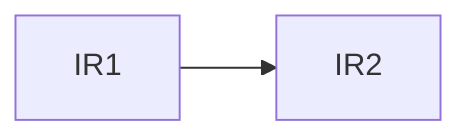

This is a summary of Pooria and Mingyang's paper that was supposed to be released for NSDI 2022, but did not happen.

This compliments the material in [[Control Plane Thesis Chapter]].

# Introduction

The paper discusses the formal verification of the architecture that was described in [[Control Plane Thesis Chapter]]. To summarize, it looks similar to what [[Orion]] uses, but not really ...

Most of the focus here is to prepare the reader to understand the code based in the [NSL Repo](https://github.com/USC-NSL/RoutingConsistency/tree/master/noFailover), since we will be using that to check our implementations of this architecture (IF we actually get to do that!).

## Modules

The first step is to make sure we are on the same page. To summarize:
- The controller here uses a [[Microservice]] architecture.
- The controller aims to provide consistency first and foremost. The convergence time depends on the implementation, which we are NOT considering right now.
- The control plane core, serves the SDN applications in the northbound, and provides a communication interface for the data plane in the southbound.
- Each instruction to the controller is broken down into a series of steps by the SDN application that is then organized into a DAG that the controller will use to schedule flow programming instructions (FPIs).

It should be fairly obvious that this controllers, strictly operates on Intent-Based Networks, in fact, the main data received from the northbound concerns the *intent* of the network and the actual steps to push that intent are created and installed by the controller itself.

The main message router within the controller is a centralized Network Information Base (NIB), which serves essentially the same purpose that MD-SAL does in the [[ODL]] controller.

To summarize, the modules are:

- **Routing Engine (RE):** Creates the DAG based on the current intent and the current network state. To do this, the RE is broken down to 3 subcomponents.
	- **The Traffic Engineer (TE):** Which:
		- Compute target network state based on the intent, or responds to topology changes
		- Compute the FPI DAG based on the old and current network state.
	- **The Sequencer:** Which:
		- Digests the DAG
		- Sends the FPIs in the DAG to appropriate modules
	- **The NIB Event Handler:** Which
		- Route messages from NIB to the above sub modules.
- **Drainer:** It serves Drain/Undrain requests for other modules (including RE). It shares most of it's architecture with the RE, but serves specific FPIs for draining or undraining a switch.
- **Topology Upgrader/Expander:** 
	- The upgrader, installs new switch firmware
	- The expander, installs a new switch in the system by expanding the topology
- **OpenFlow Controller (OFC):** Converts FPIs to OpenFlow instructions that can be digested by the switch. It consists of:
	- **NIB Event Handler:** Same as before ...
	- **Event Handler:** Used to monitor switch state changes
	- **Monitoring Server:** Receives FPI status updates from the switches

The overall architecture can be seen below:

![[Pasted image 20230126161008.png]]

In the code, states are given to each component like the following:

| State           | Semantic                                  |
| --------------- | ----------------------------------------- |
| `SW_UP`         | Switch is powered up                      |
| `SW_DOWN`       | Switch is unhealthy or powered down       |
| `SW_DRAINED`    | Switch is up, but receives no traffic     |
| `SW_UNDRAINED`  | Switch is up and receives traffic         |
| `IR_NONE`       | No info about the state of the IR         |
| `IR_DONE`       | The IR has been completed                 |
| `IR_SENT`       | The operation has been sent to the switch |
| `CRTL_NORMAL`   | The module works normally                 |
| `CTRL_ABNORMAL` | The module is not working normally        | 

The paper gives an example of DAG programming. It might be useful to see this one up close.

## DAG Programming Example

For a simple DAG like the following:

What happens is:

- **In `RE.Sequencer`:**
	- Put `IR1` in `ScheduledIRSet`
	- Send `IR1` to NIB
	- Wait for `IR1` to return `IR_DONE`
	- Repeat for `IR2` after `IR1` is done
- In the NIB:
	- Receive `IR1`
	- Put `IR1` in `IRQueue`
	- Send `IRQueue` to OFC
	- Monitor IR state from the OFC updates
	- Notify RE when IR changes to `IR_DONE`
- In the OFC
	- Receive `IRQueue` for the NIB Event Handler
	- Notify NIB when received
	- Send the IR to the switch and change IR status to `IR_SENT`
	- Wait for the switch to send an ACK
	- Once ACK is received, change IR status to `IR_DONE`
	- Notify NIB when done

>[!IMPORTANT]
>All of these steps not only update local copies of variables in the module performing the update, but also MUST asynchronously notify the NIB about it as welll.
>

## Invariants And Failures

The main invariants that we wish the control plane comply to are:

- **Liveness:** All the IRs are eventually in the `IR_DONE` state.
- **Safety:** The DAG for each IR is never violated. Equivalently, this means that if `IR2` depends on `IR1`, then `IR1` will enter `IR_DONE` *before* `IR2` enters `IR_DONE`.

These invariants are evaluated under certain failure models in the spec. These are broadly categorized into:

- **Complete Failure:** The state of the component is lost due to failure.
- **Permanent Failure:** (Only for switches) Meaning that the a switch recovery protocol is needed to reboot the switch (**NOT CONSIDERED HERE!**).
- **Transient Failure:** (Only for switches) Meaning that the switch will recover at some point in the future (though the control plane does not know that!)

It's important to see what these models *actually* mean in the context of real networks. To this end, the specification consists of two different models for each switch. A *complex model* and a *simple model*.

In a simple model, the switch is basically just gets the IR, installs it and then sends an ACK instantly, which means that as long as the IR received, installation never fails.

The complex model consists of sub modules.
- **NIC/ASIC:** Which controls the interface that the switch uses to communicate with the control plane.
- **TCAM:** The buffer for received packets.
- **OFA:** The module that actually installs the IRs into the switch. 
- **Installer:** The hardware that installs the OFA output into the data plane (this is the switch firmware).
- **CPU:** Obviously ...

With the complex model in mind, failure patterns can be:

- **Complete Switch Failures:**
	- **Permanent:** A hardware issue in the switch causes it to power down 
	- **Transient:** The switch recovers and powers up after a critical hardware failure that wiped away it's current state. This means that this switch starts from a *blank state* and the TCAM and all buffers are empty.
- **Partial Transient Switch Failures:**
	- **ASIC/NIC Failure:** The interface fails, the TCP connection with the control plane is lost, the control plane detects this and marks the switch as down. The switch may still process and install received IRs and buffer ACKs to send to the controller.
	- **OFA Failure:** The OFA fails, and as a result, the TCP connection to the controller also fails. *Some state* may be lost if the switch is in the middle of working on an IR, but nothing more.
	- **Installer Failure:** The installer fails, the OFA detects this and notifies the controller. This means that the controller will now mark the switch as down. Similar to above, some state may be lost if the installer was busy, but nothing more.
	- **CPU Failure:** CPU dies, and with it everything that uses some processing power will dies as well (so OFA and Installer are out as well), once again the sudden TCP connection close will notify the controller that something is wrong. The buffers and TCAMs are good though, as long as the switch does not power down.

Along with the switches, the control plane may also die as well. Failures may happen sequentially or concurrently. In the controller, failures happen in two classes:

- **Module Failure:** The module dies completely, and takes its submodules with it as well. Recovery in this paper is always *cold*, meaning that in order to bring up the module again, a complete, new executable service needs to be loaded, initialized and reconfigured. Nothing is brought back from the previous module.
- **Submodule Failure:** Some submodule in a bigger module dies. We assume that each module has a watchdog, which monitors its submodules, and schedules recovery when anything goes wrong. Submodule state is completely lost, but state belonging strictly to the module (like say, the `IR_QUEUE` in RE) are kept intact.