# Intro.

The Transmission Control Protocol (TCP) enables two parties to reliably communicate over a faulty network. 

Its responsibilities can roughly be divided into two categories: 
- **Connection management**: Setting up the connections, managing the connection states and ensuring that the connections are closed safely and gracefully.
- **Data Transmission**: Which involves the transmission of segments from the sender to the receiver.

TCP has multiple specifications, and multiple implementations. Over the years they have been given many different names, like Reno, Cubic, Illinois, etc.

The specs include RFCs 793 and 1122, extended to include the Window Scale Option of RFC 1323, and many many more revisions over the years.

What we present here comes directly from [RFC 9293](https://www.rfc-editor.org/rfc/rfc9293) which at the time of writing this document (September 2022) is the latest revision of TCP specification.

Before we start, a quote from the RFC:

>[!QUOTE]- RFC 9293 Abstract
>This document specifies the Transmission Control Protocol (TCP). TCP is an important [[Transport]] Layer protocol in the Internet protocol stack … Over this time, a number of changes have been made to TCP as it was specified in RFC 793 … This document collects and brings those changes together with the protocol specification from RFC 793. 
>
>This document obsoletes RFC 793, as well as RFCs 879, 2873, 6093, 6429, 6528, and 6691 that updated parts of RFC 793. It updates RFCs 1011 and 1122, and it should be considered as a replacement for the portions of those documents dealing with TCP requirements. It also updates RFC 5961 by adding a small clarification in reset handling while in the SYN-RECEIVED state. The TCP header control bits from RFC 793 have also been updated based on RFC 3168.

## Some Key Concepts

TCP: 

- Provides a reliable, in-order, byte-stream service to applications (so message-oriented services need to build some conversion on top of TCP). The application byte-stream is conveyed over the network via TCP *segments*, with each TCP segment sent as an IP packet.

- Supports unicast delivery of data. Any other form of transmission (broadcast, anycast, etc.) requires some modification to the transport layer implementation.

- Is connection oriented. Data flow is supported bidirectionally over TCP connections, though applications are free to send data only unidirectionally, if they so choose.

- Uses port numbers to identify application services and to multiplex distinct flows between hosts.

The reliability of TCP comes from two design decisions:
- Detecting packet losses with sequence numbers. 
- Detecting errors with per-segment checksums, as well as correction via retransmission.

The channel model of TCP (i.e. the medium that ultimately transmits packets) can:
- Non-deterministically change some bytes in each datagram sent.
- Can reorder different packets, but **NOT** the content of the packets themselves.
- May cause an arbitrary delay on each packet sent.

### Connection State Variables

TCP keeps track of many different variables at each state of the connection in order to ensure reliability. The variables are bundled together and stored in a record called the Transmission Control Block, or the TCB.

Among the variables stored in the TCB:
- Local and remote IP addresses and port numbers. 
- The IP security level, and compartment of the connection. 
- Pointers to the user's send and receive buffers. 
- Pointers to the retransmit queue and to the current segment. 
- Several variables relating to the send and receive sequence numbers, which we'll discuss below.


We keep the name of these variables consistent with the RFC. The `SND` and `RCV` are pointers to the send and receive buffers that we mentioned above.

| Variable  |                          Description                           |
| --------- |:--------------------------------------------------------------:|
| `SND.UNA` |                      Send unacknowledged                       |
| `SND.NXT` |                           Send next                            |
| `SND.WND` |                          Send window                           |
| `SND.UP`  |                      Send urgent pointer                       |
| `SDN.WL1` |    Segment sequence number used for the last window update     |
| `SND.WL2` | Segment acknowledgement number used for the last window update |
| `ISS`     |                  Initial send sequence number                  |
| `RCV.NXT` |                          Receive next                          |
| `RCV.WND` |                         Receive window                         |
| `RCV.UP`  |                     Receive urgent pointer                     |
| `IRS`     |                Initial receive sequence number                 |

Similar to how it was first defined, these variables can be conceptually related to each other like the following:

![[Pasted image 20220917214202.png]]

And for receiving we have:

![[Pasted image 20220917214513.png]]

TCP also transmits packets as segments, so we also need to keep track of some variables for the segments that we want to send. At each point, TCP attempts to send the current segment which is a pointer called `SEG` and it can reference the following variables:

| Variable  |          Description          |
| --------- |:-----------------------------:|
| `SEG.SEQ` |    Segment sequence number (i.e. The sequence number of the first octet)    |
| `SEG.ACK` | Segment acknowledgment number (i.e. Next sequence number expected by the peer) |
| `SEG.LEN` |        Segment length (i.e. Number of octets in the segment data, counting `SYN` and `FIN`)         |
| `SEG.WND` |        Segment window         |
| `SEG.UP`  |    Segment urgent pointer     | 

We'll discuss these later.

### Sequence Numbers

Every octet of data sent over a TCP connection has a sequence number. 

Since every octet is sequenced, each of them can be acknowledged. The acknowledgment mechanism employed is cumulative so that **an acknowledgment of sequence number $\textbf{n}$ indicates that all octets up to but not including $\textbf{n}$ have been received**. 

This mechanism allows for straightforward duplicate detection in the presence of retransmission.

>[!NOTE] Numbering Scheme of Octets in a Segment 
>The first data octet immediately following the header is the lowest numbered, and the following octets are numbered consecutively

>[!IMPORTANT]
>The sequence space is finite. Sequence numbers are 32 bits and so every arithmetic operation using these values is *implicitly* done modulo $2^{32}$.

Certain operations are done with sequence numbers during each state in the state machine, these produce flags that the state machine can use to find out about the specific actions that it must take. 

These include:

| Condition Name               | Condition Predicate                                    | Condition Description                                                      |
| ---------------------------- | ------------------------------------------------------ | -------------------------------------------------------------------------- |
| `ACKAcceptable`              | `SND.UNA < SEG.ACK <= SND.NXT`                         | A received ACK is acceptable                                               |
| `SEGFinished`                | `SEG.SEQ + SEG.LEN <= INCOMING_SEG.ACK`                | A segment on the retransmission queue is finished                          |
| `ValidReceiveHead`           | `RCV.NXT <= SEG.SEQ < RCV.NXT + RCV.WND`               | A received segment starts within the window                                |
| `ValidReceiveTail`           | `RCV.NXT <= SEG.SEQ + SEG.LEN - 1 < RCV.NXT + RCV.WND` | A received segment finishes within the window                              |
| `ValidReceiveWithDataAndWnd` | `ValidReceiveHead` $\vee$ `ValidReceiveTail`           | A received segment with non-zero length, with a non-zero window, is valid  |
| `ValidReceiveNoWnd`          | `ValidReceiveHead`                                     | A received segment with zero length and no window is valid                 |
| `ValidReceiveNoWndNoData`    | `SEG.SEQ = ECV.NXT`                                    | A received segment with zero length and no window is valid |

>[!IMPORTANT]
>A segment with non-zero length, received during a period where the receive window is 0, is not acceptable.
>


#### Sequence Number Initialization

For each connection there is a send sequence number and a receive sequence number. The initial send sequence number (`ISS`) is chosen by the data sending TCP peer, and the initial receive sequence number (`IRS`) is learned during the connection-establishing procedure.

The first sequence number of a TCP connection is sampled from a combination of a monotonically increasing number sequence (the sequence wraps in the end to 0) that is implemented with a 32 bit counter, with a clock of roughly 4 microseconds, plus some pseudo random function of local parameters and a secret key that **MUST NOT** be computable from outside.

See the RFC for the exact description of this procedure.

>[!FAQ]- Why 4 Microseconds?
>It is for the most part an arbitrary choice.
>
>TCP defines a measure called Maximum Segment Lifetime (MSL). It reflects the time that a TCP segment can exist in the internetwork system. Equally arbitrarily, it has been set to be roughly **2 minutes**.
>
>TCP connections may fail and then come back, or be reused without necessarily re-opening the connection. This *can* create a problem. If a connection sends many segments and then dies, but is restarted, the TCP endpoint can in theory lose track of what sequence numbers it was using, and so be unable to distinguish between duplicate segments (i.e. it can't necessarily decide that the segment it is receiving now is from the old connection or the new one).
>
>To prevent this, TIMED-WAIT state prevents too many connection reuses, but also, the choice of initial sequence number can help with this matter. If during the MSL, we can be somewhat sure that the `ISN` will not repeat between reuses of a connection, we can avoid confusion. Thus the clock should not wrap within the timespan of the MSL.
>
>For this, the clock must wrap in a much longer time. With the number given above, it will take roughly 5 hours for the timer to wrap.

### Synchronization

For each connection there is a send sequence number and a receive sequence number. 

The initial send sequence number (ISS) is chosen by the data sending TCP peer, and the initial receive sequence number (IRS) is learned during the connection-establishing procedure.

For a connection to be established or initialized, the two TCP peers must synchronize on each other's initial sequence numbers. 

This is done in an exchange of connection-establishing segments carrying a control bit called "SYN" (for synchronize) and the initial sequence numbers. As a shorthand, segments carrying the SYN bit are also called "SYNs", but when we want to refer to these segments we write them as `SYN` . 

The synchronization requires each side to send its own initial sequence number and to receive a confirmation of it in acknowledgment from the remote TCP peer. Each side must also receive the remote peer's initial sequence number and send a confirming acknowledgment.

Here is a conceptual scenario of this:

```mermaid
sequenceDiagram
	participant A as TCP Peer A
	participant B as TCP Peer B
	A ->> B: SYN[My Sequence Number is X]
	rect rgb(30, 70, 40)
	B ->> A: ACK[Your Sequence Number is X]
	B ->> A: SYN[My Sequene Number is Y]
	end
	A ->> B: ACK[Your Sequence Number is Y]
```



The highlighted sequence is usually combined into a single step, so this is usually called a 3 way handshake (*3WHS*).

>[!IMPORTANT]
>No data will be sent before the handshake finishes. If data arrives to be sent during this interval, it must be buffered.

>[!FAQ] Simultaneous Synchronization
>TCP allows for two peers to simultaneously attempt to handshake (i.e. two peers can actively try to connect to each other without the other really waiting for any connection attempt).
>
>This has a slightly different message exchange, which we'll see later in the examples.

## TCP State Machine

A connection progresses through a series of states during its lifetime. 

We will describe them below:

| State Name   | State Description                                                                                               |
| ------------ | --------------------------------------------------------------------------------------------------------------- |
| LISTEN       | Waiting for a connection from some peer or port                                                                 |
| SYN-SENT     | Waiting for a matching connection request after sending a connection request                                    |
| SYN-RECEIVED | Waiting for a confirming connection request ACK. after both endpoints received a connection request             |
| ESTABLISHED  | Normal state of the data transfer phase. A connection is opened and data received will be delivered to the user |
| FIN-WAIT-1   | Waiting for a termination request, OR waiting for the ACK. of a previously sent termination request             |
| FIN-WAIT-2   | Waiting for a termination request from the remote TCP endpoint                                                  |
| CLOSE-WAIT   | Waiting for termination request by user                                                                         |
| CLOSING      | Waiting for termination request ACK. from the remote endpoint                                                   |
| LAST-ACK     | Waiting for the acknowledgment of a previously sent termination request                                         |
| TIMED-WAIT    | Waiting for the termination acknowledgment to reach the remote peer                                             |
| CLOSED       | No connection state                                                                                                                |

States change in response to *Events*, which can be categorized into:
- *User Events*: Events triggered by the Application Layer, these include `OPEN`, `SEND`, `RECEIVE`, `CLOSE`, `ABORT` and `STATUS`.
- *Segment Events*: Events concerning ordinary segments
- *Flagged Segment Events*: Events concerning certain special segments that contain a special flag. These include `SYN`, `ACK`, `RST` and `FIN`.
- *Timeouts*: Multiple timeouts work in TCP, we'll discuss them later.


The particular action `OPEN` has two forms:
- Passive Open: A TCP port is opened and is waiting for some connection request to come.
- Active Open: The local endpoint is actively sending connection requests to it's destination endpoint.


### Simple TCP State Diagram

Emphasis on *Simple*, this by no means tells all about the TCP specification, but lays some useful ground work.

![[output-onlinepngtools.png|500]]

This is a pretty printed version of the state diagram in the RFC, from [HERE](https://www.researchgate.net/profile/Diego_Zamboni/publication/3696986/figure/download/fig8/AS:490695141138458@1494002246418/depicts-the-TCP-state-machine-Figure-courtesy-of-Douglas-E-Comer-2.png)

>[!IMPORTANT]- How To Read This Diagram
>Remember that each transition written as `e/a` means that if the event `e` happens, then the action `a` must be done, which usually is sending a certain segment.
>
>For example the transition from SYN-RECEIVED to FIN-WAIT-1 given `close/fin` means that when the user requests for a `CLOSE`, then send a `FIN` segment.
>
>Of course multiple actions may also happen, like the transition from SYN-SENT to SYN-RECEIVED is written as `syn/syn + ack` which means that upon receiving a `SYN`, send a `SYN` and an `ACK` segment.

There is the following unwritten things to consider about the diagram above:
- Transition from SYN-RECEIVED to LISTEN given `RST` happens only when the connection was opened passively. Receiving a `RST` at any other state under any other condition will transition us to the CLOSED state. 
- At any state, a `RST` can be sent with a corresponding transition to `TIMED-WAIT`.

These have been omitted to keep the diagram readable.

A general classification of these states is helpful:
- 

### Examples Of Connection Establishment

>[!IMPORTANT]- How To Read The Following Connection Sequences
> - `-->` means departure of a TCP segment from peer A to peer B
> - `<--` means departure of a TCP segment from peer B to peer A
> - `...` indicate a segment that is delayed and still in the network
> - The connection states represent the state of the peer **AFTER** the departure/arrival of the segment.
> 
> - For each segment, the contents appear as a list of `<key=value>` fields, where possible keys are:
> 	- `SEQ` for sequence number
> 	- `ACK` for ACK sequence number
> 	- `CTL` for control flag
> 
> - An arbitrary field `<DATA>` represents segment payload

>[!REMINDER]
>Remember that both sides are *buffered*, so the ordering of message arrivals is for the most part arbitrary, TCP just puts any segment that it does not expect into the buffer until either the buffer overflows or it gets what it expects.
>
>So the ordering that we have shown is the order by which segments are *processed*, not the order by which they arrive.

#### 3WHS

```
    TCP Peer A                                            TCP Peer B

1.  CLOSED                                                LISTEN

2.  SYN-SENT    --> <SEQ=100><CTL=SYN>                --> SYN-RECEIVED

3.  ESTABLISHED <-- <SEQ=300><ACK=101><CTL=SYN,ACK>   <-- SYN-RECEIVED

4.  ESTABLISHED --> <SEQ=101><ACK=301><CTL=ACK>       --> ESTABLISHED

5.  ESTABLISHED --> <SEQ=101><ACK=301><CTL=ACK><DATA> --> ESTABLISHED
```

This is fairly straightforward:
	1. Peer B is listening for connection attempts (PASSIVE-OPEN) and peer A is about to initiate connection.
	2. Peer A generates an initial sequence number of 100. Peer A sends a `SYN` with this sequence number and transitions to the SYN-SENT state. 
		Peer B receives this segment, records the sequence number 100 for its initial receive sequence number and *expects* the next to be 101, now it transitions to SYN-RECEIVED.
	3. Peer B sends a `SYN` and `ACK` (technically an `ACK` and then a `SYN`, but since we usually piggyback these two, we simply call this pair a `SYN,ACK`) with a sequence number that it initialized (being 300) and an ACK sequence of `100+1 = 101`, meaning that "I expect you to send the segment with sequence number 101 next".
		Peer A receives this, records the sequence number 300 for the IRS. Afterward, it transitions to ESTABLISHED.
	4. Peer A sends an `ACK` with sequence number 101 and ACK number 301.
		Peer B receives this and also transitions to ESTABLISHED.
	5. Peer A, as it was the ACTIVE-OPEN peer, now sends ACK segments with data, starting from sequence number 101.

#### Simultaneous OPEN Attempts

```
    TCP Peer A                                       TCP Peer B

1.  CLOSED                                           CLOSED

2.  SYN-SENT     --> <SEQ=100><CTL=SYN>              ...

3.  SYN-RECEIVED <-- <SEQ=300><CTL=SYN>              <-- SYN-SENT

4.               ... <SEQ=100><CTL=SYN>              --> SYN-RECEIVED

5.  SYN-RECEIVED --> <SEQ=100><ACK=301><CTL=SYN,ACK> ...

6.  ESTABLISHED  <-- <SEQ=300><ACK=101><CTL=SYN,ACK> <-- SYN-RECEIVED

7.               ... <SEQ=100><ACK=301><CTL=SYN,ACK> --> ESTABLISHED
```

We alluded to this kind of connection establishment, here we give the full message sequences. It is not too different to the previous example.

#### Duplicate `SYN`

```
    TCP Peer A                                       TCP Peer B

1.  CLOSED                                           LISTEN

2.  SYN-SENT    --> <SEQ=100><CTL=SYN>               ...

3.  (duplicate) ... <SEQ=90><CTL=SYN>                --> SYN-RECEIVED

4.  SYN-SENT    <-- <SEQ=300><ACK=91><CTL=SYN,ACK>   <-- SYN-RECEIVED

5.  SYN-SENT    --> <SEQ=91><CTL=RST>                --> LISTEN

6.              ... <SEQ=100><CTL=SYN>               --> SYN-RECEIVED

7.  ESTABLISHED <-- <SEQ=400><ACK=101><CTL=SYN,ACK>  <-- SYN-RECEIVED

8.  ESTABLISHED --> <SEQ=101><ACK=401><CTL=ACK>      --> ESTABLISHED
```

Here is how the `RST` segment can be used.
1. Peer B is listening, Peer A just recovered from a failure and has restarted connection, a sequence number 100 is chosen and `SYN` is sent to start 3WHS.
2. Peer A sends a `SYN` with sequence number 100, but it is delayed somewhat in the network. Peer A transitions to SYN-SENT in the meantime.
3. A duplicate `SYN` from the previous connection of peer A still lingers in the network. This `SYN` reaches Peer B. Peer B accepts this `SYN`, sets the initial sequence number and so ACKs the sequence number 90 + 1 = 91, thus transitioning to SYN-RECEIVED.
4. Peer B sends the typical `SYN,ACK` with its chosen sequence number of 300, this reaches Peer A.
	Peer A finds the segment unacceptable, since the ACK field is 91 instead of 101. Peer A does not transition from it's current state.
5. Peer A sends a `RST` *using the ACK field of the previous segment to make it believable for Peer B*.
	Peer B receives this `RST` and buffers everything else in the meantime, and after receiving this, it transitions straight to LISTENING.
6. The delayed `SYN` in step 1 is received by peer B. Normal 3WHS may now ensue.


#### Half-Open Connection

If one peer in an established TCP connection suddenly closes it's connection, then the other peer will remain oblivious to this. This is expected to be a rarity, but happens much more often with sockets, when programmers forget to explicitly state `socket.clise()` at the end of a connection.

What happens in this case looks like the following:

```
      TCP Peer A                                      TCP Peer B

  1.  (REBOOT)                              (send 300,receive 100)

  2.  CLOSED                                           ESTABLISHED

  3.  SYN-SENT --> <SEQ=400><CTL=SYN>              --> (??)

  4.  (!!)     <-- <SEQ=300><ACK=100><CTL=ACK>     <-- ESTABLISHED

  5.  SYN-SENT --> <SEQ=100><CTL=RST>              --> (Abort!!)

  6.  SYN-SENT                                         CLOSED

  7.  SYN-SENT --> <SEQ=400><CTL=SYN>              -->
```

1. Peer A dies and reboots, Peer B is still in ESTABLISHED.
2. Peer A returns to CLOSED, completely forgetting what was happening, it generates an initial sequence number 400 and sends a `SYN` to peer B, transitioning to SYN-SENT.
3. Peer B receives this `SYN` and is confused, it was to receive sequence 100. Since peer B is already synchronized, it merely repeats that it wants to hear segment 100 and so sends an `ACK` with the the sequence number 300 (from the previous connection), demanding that A sends segment 100.
4. Peer A receives this instead of a `SYN,ACK` with also a wrong sequence number. Since A is not synchronized it attempts to reset, sending `RST` with sequence number 100 so that B believes it.
5. Peer A sends the aforementioned `EST` and stays in SYN-SENT.
	Peer B receives this reset and immediately aborts, transitioning to CLOSED.

Normal 3WHS now ensues.

Resets have some curious semantics both for sending and receiving, so let's discuss that.

### Some Things About `RST`

Resets can be sent throughout the entirety of a TCP connection. Generally, resets are needed to be sent when a connection receives a segment that it was not supposed to. If we can't be sure of that, then **a reset should be avoided**.

Resets really clutter the state diagram at [[#Simple TCP State Diagram]], so let's clarify all of them here:

- While CLOSED, anything except another reset, will cause the peer to send a `RST`. If the segment has an ACK, then take the sequence number from that field, otherwise, set it to zero. The ACK field of the reset is set to the sum of the sequence number and segment length of the segment that just arrived. Afterwards, we stay in CLOSED.

## After Connection Establishment

After connection is established, the sender repeatedly picks segments from the buffer `SND` to send and the receiver repeatedly flushes the buffer `RCV` to get segments.

- The sender keeps the next sequence number to use in `SND.NXT` and the receiver keeps the sequence number to expect in `RCV.NXT` .
- When the sender creates a segment and transmits it, the sender advances `SND.NXT`. 
- When the receiver accepts a segment, it advances `RCV.NXT` *and* sends an acknowledgment. 
- When the data sender receives an acknowledgment, it advances `SND.UNA`. The extent to which the values of these variables differ is a measure of the delay in the communication. The amount by which the variables are advanced is the length of the data and SYN or FIN flags in the segment. Note that, once in the ESTABLISHED state, all segments must carry current acknowledgment information

TCP also uses a retransmission timeout (RTO) for sending segments when feedback is not present, we'll discuss it later in this section, for now just know that it exists.

After connection establishment, the congestion control mechanisms kickoff.

These deserve their own note, so check [[TCP Congestion Control]].

### TCP `RTO` Estimation

We mentioned the retransmission timer, but we didn't really elaborate on it, so let's discuss it here.

The retransmission timer is used to keep TCP on short leash, preventing it from choking the network when there is not enough feedback from the receiver. When the timer expires, TCP stops increasing the congestion window and restarts the slow start phase.

The value of this time is more of an interest to us here. To this end, we use **Karn's algorithm** described [here](http://ccr.sigcomm.org/archive/1995/jan95/ccr-9501-partridge87.pdf) in detail. We'll just go through a simple summary of it here.

The algorithm calls for two additional state variables, the *smoothed round-trip time* or `SRTT` and the *round-trip time variance* or `RTTVAR`. The value of the retransmission timeout is `RTO` like we discussed in [[TCP]].

Karen's algorithm repeatedly samples values for the RTT and uses it to update the additional variables above, but before any of these measurements are made, we need to set a default value for `RTO`. The spec. allows for any value higher than or equal to 1 seconds.

The rationale for the above value really isn't simple to describe, it involves many factors, such as the general speed of the internetworks and many others, see the appendices of [RFC 6298](https://www.rfc-editor.org/rfc/rfc6298.html) for some details.

Now, the sender uses a built in clock with a duration $G$, this clock is used by the TCP to sample buffers and perform calculations. Everything needs to be rounded to this value, but since most systems have a pretty fast clock, it is usually ignored when writing.

We'll present it here, mostly to remain faithful to the RFC. 

We'll discuss how RTT values are sampled later, let's assume we get some RTT estimates from time to time, and we want to update the state variables.

#### First Measurement
For the first measurement of the RTT, let's assume the value is $r$. We have:
$$
\text{SRTT} \leftarrow r ; \quad \text{RTTVAR} \leftarrow r/2; \quad \text{RTO} \leftarrow \text{SRTT} + \max(G, 4\times\text{RTTVAR})
$$
**Note that actions are performed sequentially, from left to to right.**

#### Subsequent Measurements
For any subsequent measurement $r$, we have:
$$
\begin{align}
\text{RTTVAR} & \leftarrow (1 - \beta) \times \text{RTTVAR} + \beta \times |\text{SRTT} - r|\\
\text{SRTT}&\leftarrow (1 - \alpha) \times \text{SRTT} + \alpha \times r\\
\text{RTO} & \leftarrow \text{SRTT} + \max(G, 4 \times \text{RTTVAR})
\end{align}
$$

>[!WARNING] Minimum Value Of The $\text{RTO}$
>Most TCP implementations use a minimum value for the $\text{RTO}$, usually at least 1 seconds. This prevents too many retransmissions if the $\text{RTO}$ drops too low.

The constants $\alpha$ and $\beta$ have great effects on the performance of TCP, but how do we choose them?

In general, it depends on the RTT values, let's make some observations.

One of the main constraints about over these values, is that they should minimize the amount of retransmissions as much as possible. Now of course, a channel can still behave adversarial in such a way that it completely nullifies the effects of our RTT estimations, but most channels *do not*  do that.

In truth, most channels exhibit a Poisson-like distribution of RTTs with brief periods of high delays (by Poisson-like, we mean the *Poisson Train* model in particular)

**FINISH THIS LATER**

The RFC suggests the values $\alpha=\frac{1}{4}$ and $\beta = \frac{1}{8}$.


## TCP Header Format

Each TCP segment is sent as an IP packet. The following header is added for TCP specifically:

```
    0                   1                   2                   3
	0 1 2 3 4 5 6 7 8 9 0 1 2 3 4 5 6 7 8 9 0 1 2 3 4 5 6 7 8 9 0 1
   +-+-+-+-+-+-+-+-+-+-+-+-+-+-+-+-+-+-+-+-+-+-+-+-+-+-+-+-+-+-+-+-+
   |          Source Port          |       Destination Port        |
   +-+-+-+-+-+-+-+-+-+-+-+-+-+-+-+-+-+-+-+-+-+-+-+-+-+-+-+-+-+-+-+-+
   |                        Sequence Number                        |
   +-+-+-+-+-+-+-+-+-+-+-+-+-+-+-+-+-+-+-+-+-+-+-+-+-+-+-+-+-+-+-+-+
   |                    Acknowledgment Number                      |
   +-+-+-+-+-+-+-+-+-+-+-+-+-+-+-+-+-+-+-+-+-+-+-+-+-+-+-+-+-+-+-+-+
   |  Data |       |C|E|U|A|P|R|S|F|                               |
   | Offset| Rsrvd |W|C|R|C|S|S|Y|I|            Window             |
   |       |       |R|E|G|K|H|T|N|N|                               |
   +-+-+-+-+-+-+-+-+-+-+-+-+-+-+-+-+-+-+-+-+-+-+-+-+-+-+-+-+-+-+-+-+
   |           Checksum            |         Urgent Pointer        |
   +-+-+-+-+-+-+-+-+-+-+-+-+-+-+-+-+-+-+-+-+-+-+-+-+-+-+-+-+-+-+-+-+
   |                           [Options]                           |
   +-+-+-+-+-+-+-+-+-+-+-+-+-+-+-+-+-+-+-+-+-+-+-+-+-+-+-+-+-+-+-+-+
   |                                                               :
   :                             Data                              :
   :                                                               |
   +-+-+-+-+-+-+-+-+-+-+-+-+-+-+-+-+-+-+-+-+-+-+-+-+-+-+-+-+-+-+-+-+
```

Each tick is a single bit, so `Source Port` and `Destination Port` for example are 16 bit fields.