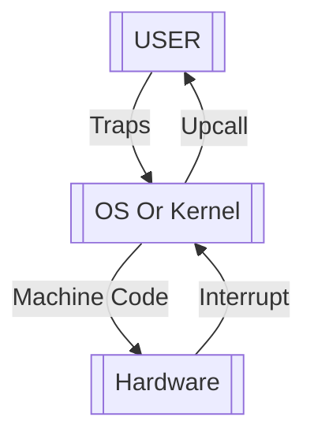

# Introduction

## Definitions

First, some general terms:

- **What is an OS?** 
	- The Operating System is a means of abstraction for working with hardware. In brief, it provides the means for software to work with hardware.
	- This abstraction isn't free!, it has quite a hefty cost.
- **What is an object?**
	- As long as we are not discussing programming paradigms, it is merely a general term for ANY data structure within the OS.
- **Execution Context**
	- Any metadata necessary to keep track of the execution of any task within the OS.
	- The EC allows the OS to drop tasks, go do something else, and come back as if nothing happened.
- **Hardware**
	- Without getting bugged down with different kinds of hardware, it merely points to:
		- The CPU
		- The memory (RAM)
		- The disk
		- Display
		- Network
		- Input peripherals (keyboard, mouse, etc.)
	- Applications are usually too imprecise (or stupid!) to use hardware directly! This is why abstraction is necessary, and the OS provides the means to do so.

>[!FAQ] Why Are Applications "Stupid" In This Context?
>In a normal system, multiple applications run at once. The "stupid" here points to the fact that these applications do not know the state of hardware as a result of the execution of other applications (in fact, they probably don't even know the state of the hardware because of their *own* actions!).
>Allowing multiple applications to use hardware directly is doomed to be a mess.

## Abstractions Within An OS

If an OS does it's job well, it will provide well defined abstractions over all the hardware. This means that the OS will provide *something* (usually a program) to the applications in it so that they would be able to use the hardware without breaking the system (or each other).

These main abstractions are:

- **File System**
	- The abstraction of the disk
- **Process**
	- The abstraction of memory
- **Threads**
	- The abstraction of CPU
- **IO**
	- The abstraction of input and output peripherals

In due course, we will understand what these actually mean, and to see what fundamental concepts are at the heart of these abstractions.

### Address Space

The address space, is an abstraction that programmers use to implement programs within an OS that provides the *process* abstraction.

![[Pasted image 20230123204041.png]]

Here:
- All the code we wrote lives in the **text** part. Modern OSes will usually make this part *read only*.
- The **data** section stores global variables.
- **Heap** or the dynamic memory stores dynamically allocated variables.
- **Stack** tracks function calls and function arguments.

>[!IMPORTANT]
>Note the following:
>- The main memory layout is decided by the **Compiler**, not the programmer.
>- If the Heap and the Stack run into each other, we are in trouble!
>- The address space is small, therefore a lot of sharing is needed. The OS is supposed to handle these.

Some examples:
- Dynamically allocated memories (like with `malloc()`) live in the Heap, and the program keeps track of them with a pointer.
- Stacks contain **Stack Frames**, which keep track of the function *call*, and *function arguments*. Everything you ever wrote lives in a function (i.e. main), therefore every call in a program can be recorded in a stack.

### Memory Sharing

One important concept in the OS is how we share memory among programs.

There is two general ways.

1. Split the memory into chunks and give them to programs

![[Pasted image 20230123204956.png]]

2. Virtual memory. Map physical space into an *imaginary* memory and give it to the program to use as it sees fit. The OS has to keep track of the *virtual memory map* (the OS might need hardware help as well!). If the OS runs out of space, then it needs to use disks as well.

![[Pasted image 20230123205232.png]]

## Concurrency 

How to run multiple programs on a single CPU?

Well, by *juggling*, servicing different processes and going to others with some specific schedule. If done correctly, **each process should think that it has it's own CPU**.

This concept in general is called *concurrency*, and one of the more fundamental implementations of concurrency in the OS is with **threads**.

Threads:
- Can be spawned at will and given to processes.
- Can be *suspended* to pause the execution and free the CPU. (this is where we need Execution Contexts!)

>[!FAQ] Parallelism
>Here, we don't distinguish between parallelism and concurrency. But in general, parallelism is meaningful in the context of multiple *workers*, and in an OS, that is only meaningful when we work with multiple processors.
>One of the implementations of parallelism is the aptly named **Multi Processing** paradigm. We don't care about it in this class though.

This will be one of our major course materials.

>[!WARNING] Side Note: Processor Modes
>The CPU has an internal state. One part of that state is the *processor mode*, which is either:
>- **User Mode:** Fewest privileges, meaning that the process may not use any hardware.
>- **Privileged Mode:** You can use hardware, and usually only reserved for the kernel.
>
>For our kernel implementation, everything in the OS will run in privileged mode, but if you wish to be precise, the term *kernel*, refers to the part of the OS that runs in privileged mode.
>
>The OS that we will use in the class however is based on *sixth edition Unix*, and for that particular OS, the two terms are interchangeable.

## Simple OS Structure

In it's simplest form, the OS is the abstraction between the user and hardware, and this can be represented as 3 layers:

By definition, all that interacts with hardware directly runs in privileged mode. In order to facilitate what we talk about at each layer, the way these layers interact with each other is given a name:

- **User Space --> Kernel:** These are called **Traps** (as if a trap-door opens between the OS and the user space and the application "falls" into the privileged mode temporarily).

- **Hardware --> Kernel:** These are **Interrupts**. It turns out that from a hardware clock standpoint, the OS actually sleeps most of the time! Meaning that the OS operates in a much longer timescale compared to the hardware. To maintain interaction with the OS when it's necessary, the hardware needs to "wake up" the OS, and this is done with hardware signals called *interrupts*.
  Assuming you still remember Logic Circuits and Computer Architecture, it's quite easy to see how this might be implemented with the bus architecture.
  
  >[!EXAMPLE] I/O Interrupts
  >We'll see I/O interrupts many times. These include network and disk accesses for example (memory though is different, don't confuse them!). 
  >
  >When the OS wants to access file X, it "opens" it, meaning that it will establish a stream between whatever devices wants to read it, and it's physical storage on the disk by reading those bits on the disk into memory. This is a call from the OS to the hardware which is different, but once the disk is done, it notifies the OS that it's done with an interrupt.
  >
  >In terms of implementation, once the hardware interrupt kicks in, the moment that they enter the OS layer, they will call a piece of OS code called the **Interrupt Service Routine (ISR)**, and this is essentially the same as a `close(FILE*)` in the kernel space, but generated by hardware instead of the user.
  
  It may also serve us well to remind ourselves of Computer Architecture here:
  
>[!REMINDER]- Bus Architecture
>In an abstract manner, an x86 (i.e. 32 bit CPU) interacts with all devices via controllers, which connect to the CPU with wires called "BUS".
>
>![[Pasted image 20230128182850.png]]
>Bus wires are addressed with a unique string of numbers and letters abstractly. For example, the A0-A31 bus is a 32 bit line that lets the device receive data from the CPU. 
>
>So for example, once we want to read something in the memory, we start a "read bus cycle", we put the physical address we want (say `x`) on the bus, we do this by putting the address of x (i.e. `&x`) on the bus by setting A0-A31 to the appropriate bit pattern, and since we want to read from memory, we set the `RD` bit to UP, and then the memory responds by setting the value of `x` on the D0-D31 wire.
>
>![[Pasted image 20230128184006.png]]
>
>It's also important that we remind ourselves of some other internal parts in the CPU, most importantly the registers. Referring to the figure above, we have:
>
>- **Index Registers:**
>	- `EIP`: Or the **Instruction Pointer**, this 32 bit value points to a portion in the code address space of the virtual memory, and it is the instruction that the CPU should execute now. 
>	- `ESP`: Or the **Stack Pointer**, which points to the top of the stack. This register points to the next function call (so for example if `main` calls `x` that then calls `y` and then calls `z` inside each other, then the stack would be from bottom to top `main`, `x`, `y`, `z` and the `ESP` will point to `z`).
>	- `EBP`: Or the **Base Pointer**, it points into somewhere *inside* the top of the stack, it allows us to access local variables and arguments. We'll learn about them later
>- **Segment Registers:**
>  These are not really interesting, there is the *Co-segment* or `CS`, there is the *Stack segment* or `SS` and others, all we need to know is that the mode bit of the CPU is in the `CS`.
>- **General Registers:**
>  These are simple 32 bit storages that are really fast and can be used repeatedly to do assembly instructions. They have many names, like `EAX`, `EBX`, ... or `t0`, `t1`, ...
>- **Others**:
>	- `FLAG`: Some bits that show the result of the most recent operations (like if the result of an arithmetic operation is zero, there is a `Z` bit in this register that is set to 1 when this happens), Aside these, there is also the *interrupt enabled* or `IE`, which when set, allows the CPU to respond to interrupts. 
>	  The bus itself has an `INT` bit that allows devices to request an interrupt, depending on the combination of the `INT` and `IE`, 2 interesting cases exist which can be made up like the following:
>		  1. `IE = 0`, `INT = 1`: The "interrupt pending" case, the device requests an interrupt, but the CPU is just not ready to serve it. The CPU however will *remember* this.
>		  2. `IE = 1`, `INT = 1`: The "interrupt delivery", where the CPU stops whatever it's doing and serves the interrupt.
>	  When the CPU is serving an interrupt service routine, we say that the CPU is in the *interrupt context*, otherwise, the CPU is in the *thread context* as far as this class is concerned.

